# MediaCrawlerPro 整体架构文档

## ⚠️ 重要声明

**本项目仅供学习和研究目的使用**，使用者应严格遵守以下原则：

1. **不得用于任何商业用途**
2. 使用时应遵守目标平台的使用条款和robots.txt规则
3. 不得进行大规模爬取或对平台造成运营干扰
4. 应合理控制请求频率，避免给目标平台带来不必要的负担
5. 不得用于任何非法或不当的用途

详细许可条款请参阅项目根目录下的 [LICENSE](../LICENSE) 文件。使用本代码即表示您同意遵守上述原则和LICENSE中的所有条款。

---

## 1. 系统概述

MediaCrawlerPro是一个基于Python的多平台社交媒体数据采集系统，支持小红书(XHS)、微博(Weibo)、抖音(Douyin)、快手(Kuaishou)、哔哩哔哩(Bilibili)、百度贴吧(Tieba)、知乎(Zhihu)等主流平台。

系统采用模块化设计，具有高度的可扩展性和可维护性，专为**教育学习**和**技术研究**目的而开发。

## 2. 整体架构图

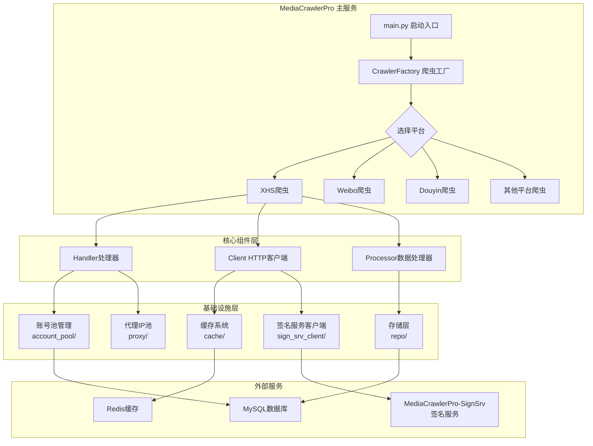

## 3. 核心架构层级

### 3.1 应用层 (Application Layer)

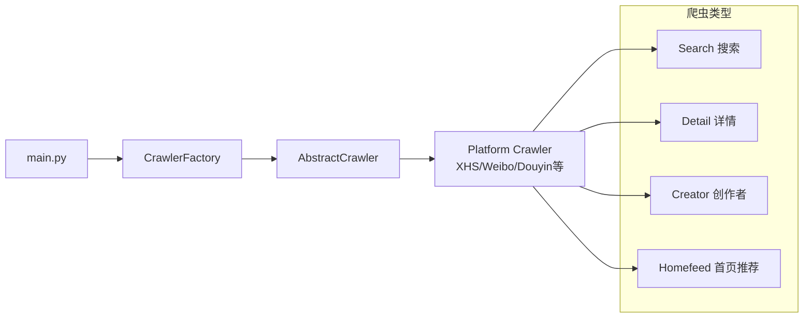

**核心组件：**
- `main.py`: 系统启动入口，负责初始化配置和启动爬虫
- `CrawlerFactory`: 工厂模式，根据平台类型创建相应的爬虫实例
- `AbstractCrawler`: 抽象基类，定义了所有爬虫的通用接口

### 3.2 业务逻辑层 (Business Logic Layer)

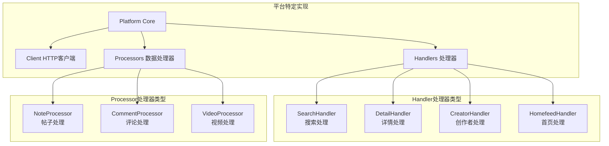

**核心职责：**
- **Client**: 负责HTTP请求的发送和响应处理
- **Handler**: 处理不同类型的爬取任务（搜索、详情、创作者、首页）
- **Processor**: 处理爬取到的数据，进行清洗、转换和存储

### 3.3 基础设施层 (Infrastructure Layer)

#### 3.3.1 账号池管理系统

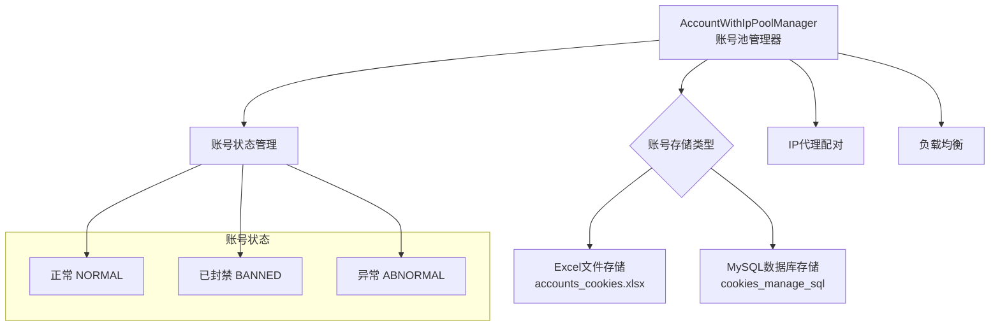

**功能特性：**
- 支持多账号轮询使用，降低封号风险
- 账号与IP代理一对一绑定，保证请求的一致性
- 实时状态监控，自动处理异常账号

#### 3.3.2 代理IP池系统

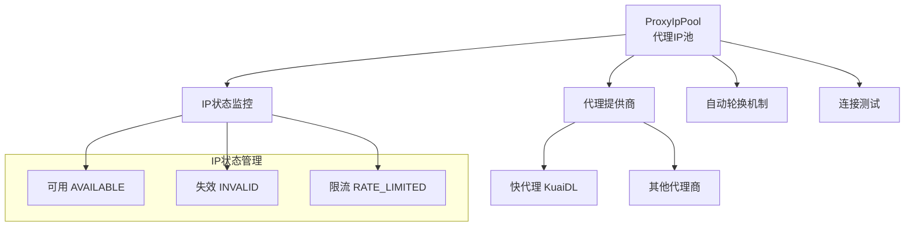

#### 3.3.3 缓存系统

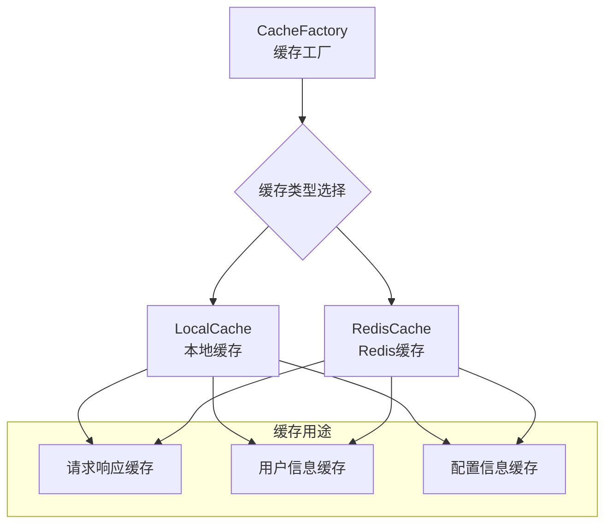

#### 3.3.4 签名服务客户端

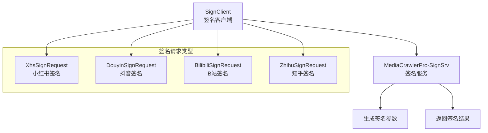

**服务解耦：**
- 将签名生成逻辑从主服务中抽离
- 支持多语言客户端接入
- 提高系统的可维护性和扩展性

### 3.4 数据持久化层 (Data Persistence Layer)

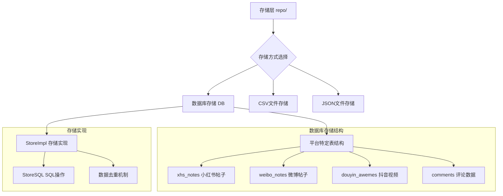

## 4. 数据流架构

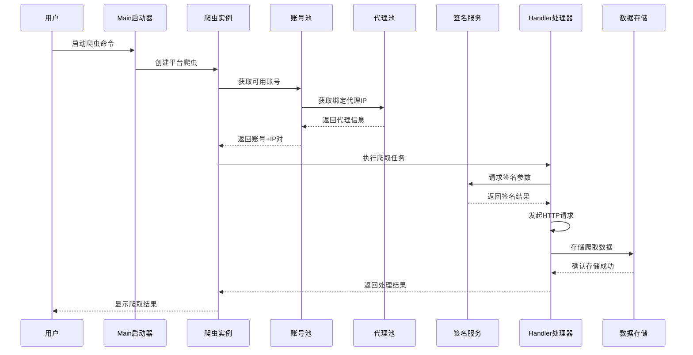

## 5. 配置管理架构

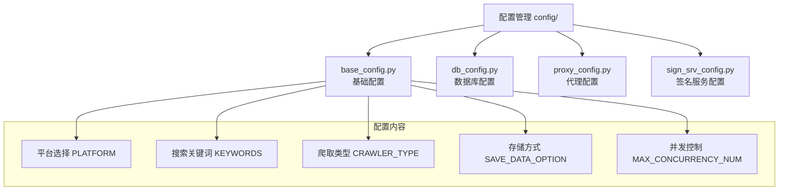

## 6. 断点续爬系统

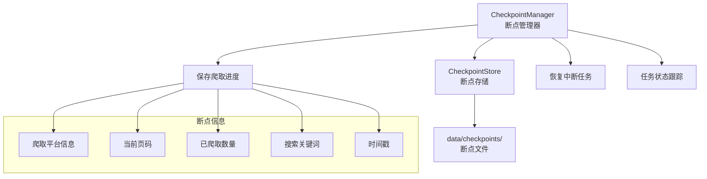

## 7. 系统特性

### 7.1 可扩展性
- **平台扩展**: 通过继承AbstractCrawler轻松添加新平台支持
- **存储扩展**: 支持多种数据存储方式，易于扩展新的存储后端
- **缓存扩展**: 通过CacheFactory模式支持多种缓存实现

### 7.2 容错性
- **账号轮换**: 自动处理账号封禁，切换备用账号
- **重试机制**: 内置请求重试和错误处理机制
- **断点续爬**: 支持任务中断后从上次位置继续

### 7.3 性能优化
- **并发控制**: 可配置的并发爬取数量
- **缓存策略**: 多层缓存减少重复请求
- **连接池**: HTTP连接复用提高请求效率

## 8. 部署架构

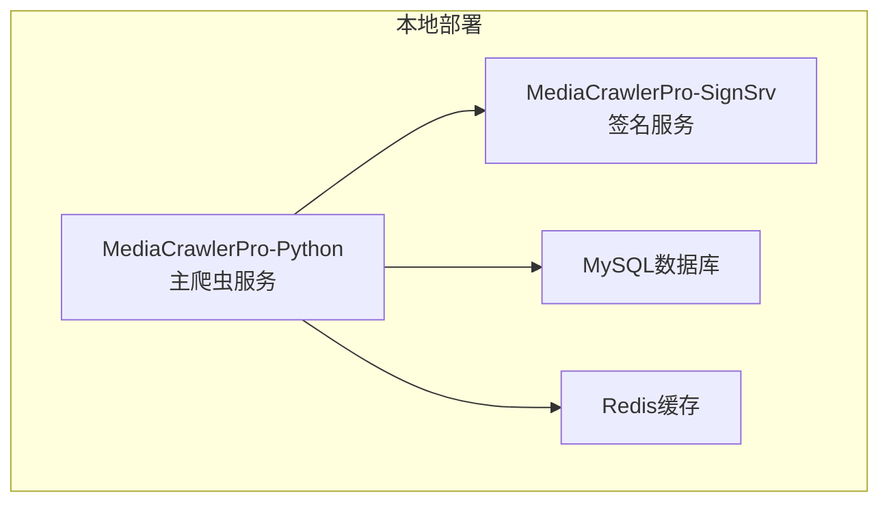

## 9. 安全与合规

### 9.1 请求频率控制
- 内置请求间隔控制，避免对目标平台造成压力
- 可配置的并发数量限制
- 基于平台特性的自适应频率调整

### 9.2 数据合规
- 仅爬取公开信息，不涉及隐私数据
- 遵循各平台的robots.txt规则

### 9.3 使用限制
- **严禁商业用途**: 仅限学习和研究使用
- **频率限制**: 必须合理控制请求频率
- **平台规则**: 必须遵守目标平台使用条款

---

## 总结

MediaCrawlerPro采用分层架构设计，通过模块化的组件组织，实现了高度的可维护性和可扩展性。系统严格遵循**仅供学习使用**的原则，在技术实现上注重性能优化和容错处理，为学习者提供了一个优秀的爬虫技术研究平台。

**请务必遵守LICENSE协议，仅将本项目用于学习和研究目的，不得用于任何商业用途或对平台造成不当影响的行为。**