# 3. 哔哩哔哩平台源码深度分析

## ⚠️ 重要声明

**本项目仅供学习和研究目的使用**，使用者应严格遵守以下原则：

1. **不得用于任何商业用途**
2. 使用时应遵守目标平台的使用条款和robots.txt规则
3. 不得进行大规模爬取或对平台造成运营干扰
4. 应合理控制请求频率，避免给目标平台带来不必要的负担
5. 不得用于任何非法或不当的用途

详细许可条款请参阅项目根目录下的 [LICENSE](../LICENSE) 文件。

---

## 1. B站爬虫整体架构概览

### 1.1 模块结构图

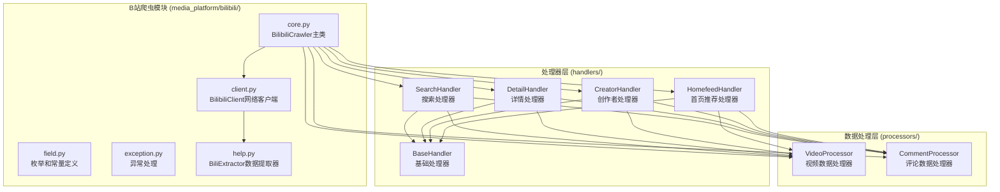
```mermaid
graph TB
    subgraph "B站爬虫模块 (media_platform/bilibili/)"
        A[core.py<br/>BilibiliCrawler主类]
        B[client.py<br/>BilibiliClient网络客户端]
        C[field.py<br/>枚举和常量定义]
        D[exception.py<br/>异常处理]
        E[help.py<br/>BiliExtractor数据提取器]
    end
    
    subgraph "处理器层 (handlers/)"
        F[SearchHandler<br/>搜索处理器]
        G[DetailHandler<br/>详情处理器]
        H[CreatorHandler<br/>创作者处理器]
        I[HomefeedHandler<br/>首页推荐处理器]
        J[BaseHandler<br/>基础处理器]
    end
    
    subgraph "数据处理层 (processors/)"
        K[VideoProcessor<br/>视频数据处理器]
        L[CommentProcessor<br/>评论数据处理器]
    end
    
    A --> B
    A --> F
    A --> G
    A --> H
    A --> I
    A --> K
    A --> L
    
    F --> J
    G --> J
    H --> J
    I --> J
    
    F --> K
    F --> L
    G --> K
    G --> L
    H --> K
    H --> L
    I --> K
    I --> L
    
    B --> E
```

### 1.2 核心组件依赖关系

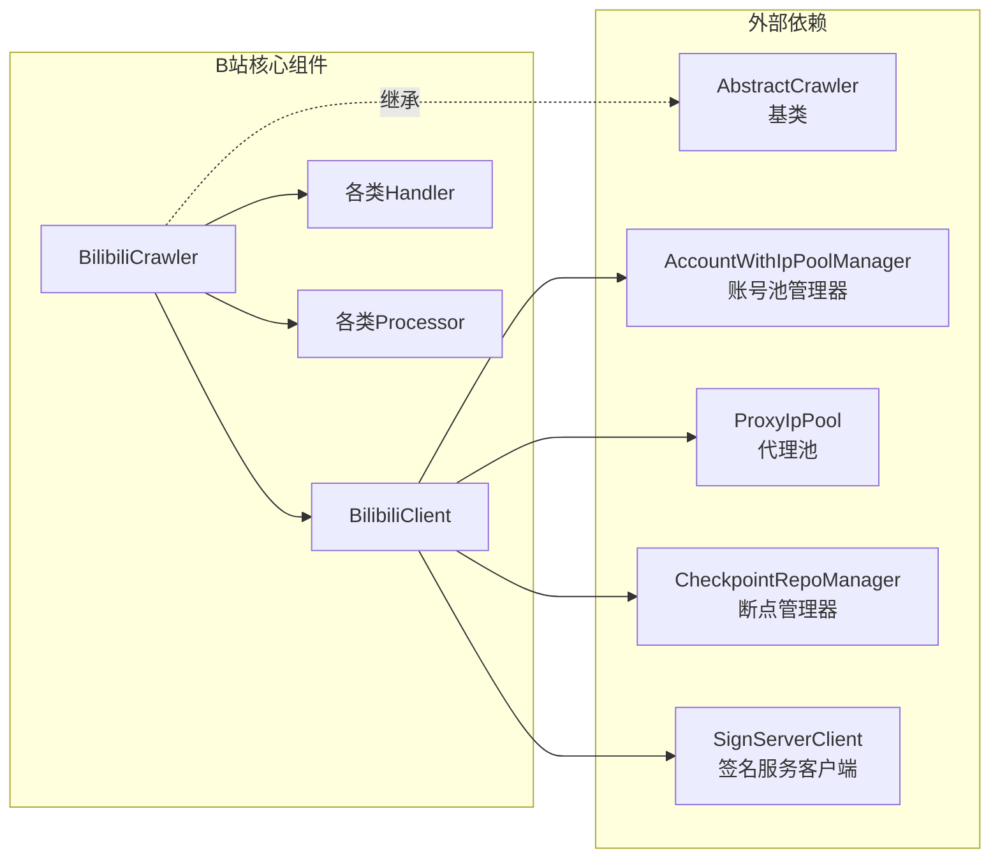
```mermaid
graph LR
    subgraph "外部依赖"
        A[AbstractCrawler<br/>基类]
        B[AccountWithIpPoolManager<br/>账号池管理器]
        C[ProxyIpPool<br/>代理池]
        D[CheckpointRepoManager<br/>断点管理器]
        E[SignServerClient<br/>签名服务客户端]
    end
    
    subgraph "B站核心组件"
        F[BilibiliCrawler]
        G[BilibiliClient]
        H[各类Handler]
        I[各类Processor]
    end
    
    F -.继承.-> A
    F --> G
    F --> H
    F --> I
    G --> B
    G --> C
    G --> D
    G --> E
```

## 2. 面向对象设计分析

### 2.1 继承层次结构

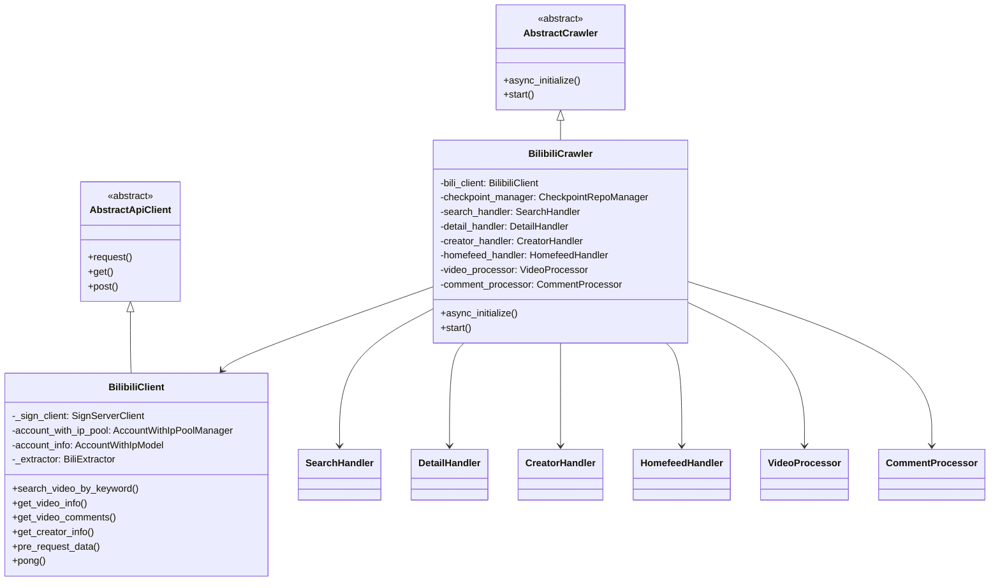
```mermaid
classDiagram
    class AbstractCrawler {
        <<abstract>>
        +async_initialize()
        +start()
    }
    
    class AbstractApiClient {
        <<abstract>>
        +request()
        +get()
        +post()
    }
    
    class BilibiliCrawler {
        -bili_client: BilibiliClient
        -checkpoint_manager: CheckpointRepoManager
        -search_handler: SearchHandler
        -detail_handler: DetailHandler
        -creator_handler: CreatorHandler
        -homefeed_handler: HomefeedHandler
        -video_processor: VideoProcessor
        -comment_processor: CommentProcessor
        +async_initialize()
        +start()
    }
    
    class BilibiliClient {
        -_sign_client: SignServerClient
        -account_with_ip_pool: AccountWithIpPoolManager
        -account_info: AccountWithIpModel
        -_extractor: BiliExtractor
        +search_video_by_keyword()
        +get_video_info()
        +get_video_comments()
        +get_creator_info()
        +pre_request_data()
        +pong()
    }
    
    AbstractCrawler <|-- BilibiliCrawler
    AbstractApiClient <|-- BilibiliClient
    
    BilibiliCrawler --> BilibiliClient
    BilibiliCrawler --> SearchHandler
    BilibiliCrawler --> DetailHandler
    BilibiliCrawler --> CreatorHandler
    BilibiliCrawler --> HomefeedHandler
    BilibiliCrawler --> VideoProcessor
    BilibiliCrawler --> CommentProcessor
```

### 2.2 组合模式的应用

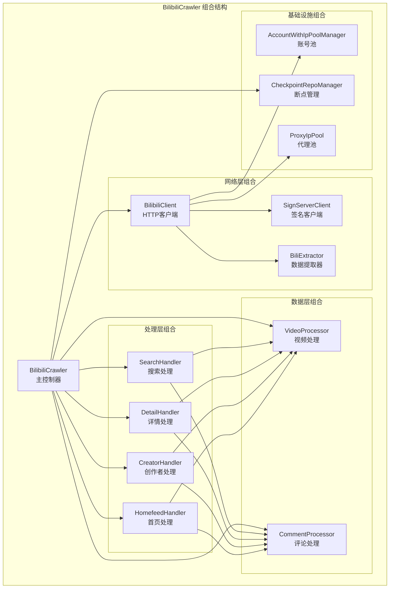
```mermaid
graph TB
    subgraph "BilibiliCrawler 组合结构"
        A[BilibiliCrawler<br/>主控制器]
        
        subgraph "网络层组合"
            B[BilibiliClient<br/>HTTP客户端]
            C[SignServerClient<br/>签名客户端]
            D[BiliExtractor<br/>数据提取器]
        end
        
        subgraph "处理层组合"
            E[SearchHandler<br/>搜索处理]
            F[DetailHandler<br/>详情处理]
            G[CreatorHandler<br/>创作者处理]
            H[HomefeedHandler<br/>首页处理]
        end
        
        subgraph "数据层组合"
            I[VideoProcessor<br/>视频处理]
            J[CommentProcessor<br/>评论处理]
        end
        
        subgraph "基础设施组合"
            K[AccountWithIpPoolManager<br/>账号池]
            L[CheckpointRepoManager<br/>断点管理]
            M[ProxyIpPool<br/>代理池]
        end
    end
    
    A --> B
    A --> E
    A --> F
    A --> G
    A --> H
    A --> I
    A --> J
    A --> L
    
    B --> C
    B --> D
    B --> K
    B --> M
    
    E --> I
    E --> J
    F --> I
    F --> J
    G --> I
    G --> J
    H --> I
    H --> J
```

## 3. 爬虫请求处理深度分析

### 3.1 请求处理流程

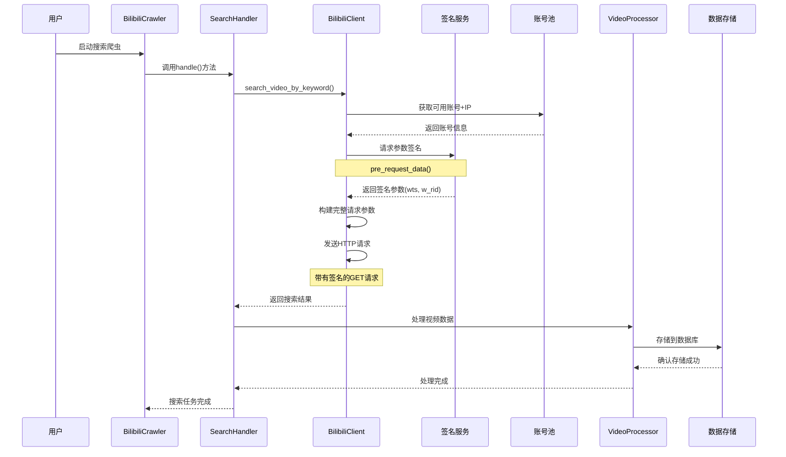
```mermaid
sequenceDiagram
    participant User as 用户
    participant Crawler as BilibiliCrawler
    participant Handler as SearchHandler
    participant Client as BilibiliClient
    participant SignSrv as 签名服务
    participant AccountPool as 账号池
    participant Processor as VideoProcessor
    participant Store as 数据存储
    
    User->>Crawler: 启动搜索爬虫
    Crawler->>Handler: 调用handle()方法
    
    Handler->>Client: search_video_by_keyword()
    Client->>AccountPool: 获取可用账号+IP
    AccountPool-->>Client: 返回账号信息
    
    Client->>SignSrv: 请求参数签名
    Note over Client,SignSrv: pre_request_data()
    SignSrv-->>Client: 返回签名参数(wts, w_rid)
    
    Client->>Client: 构建完整请求参数
    Client->>Client: 发送HTTP请求
    Note over Client: 带有签名的GET请求
    
    Client-->>Handler: 返回搜索结果
    Handler->>Processor: 处理视频数据
    Processor->>Store: 存储到数据库
    Store-->>Processor: 确认存储成功
    Processor-->>Handler: 处理完成
    Handler-->>Crawler: 搜索任务完成
```

### 3.2 请求重试机制

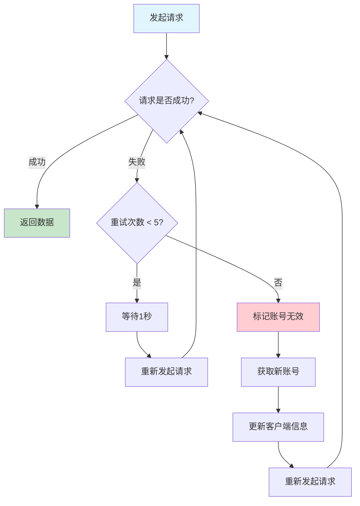
```mermaid
graph TB
    A[发起请求] --> B{请求是否成功?}
    B -->|成功| C[返回数据]
    B -->|失败| D{重试次数 < 5?}
    D -->|是| E[等待1秒]
    E --> F[重新发起请求]
    F --> B
    D -->|否| G[标记账号无效]
    G --> H[获取新账号]
    H --> I[更新客户端信息]
    I --> J[重新发起请求]
    J --> B
    
    style A fill:#e1f5fe
    style C fill:#c8e6c9
    style G fill:#ffcdd2
```

### 3.3 IP代理检查机制

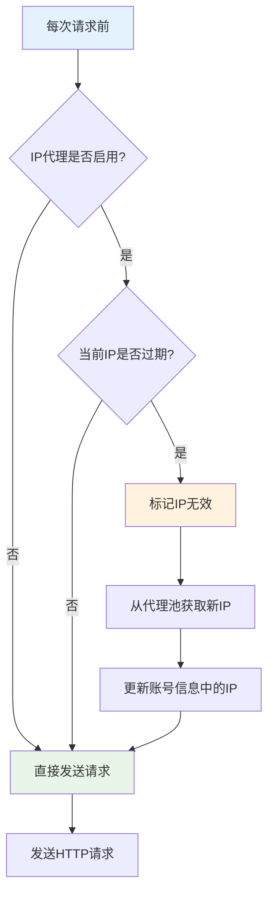
```mermaid
flowchart TD
    A[每次请求前] --> B{IP代理是否启用?}
    B -->|否| E[直接发送请求]
    B -->|是| C{当前IP是否过期?}
    C -->|否| E
    C -->|是| D[标记IP无效]
    D --> F[从代理池获取新IP]
    F --> G[更新账号信息中的IP]
    G --> E
    E --> H[发送HTTP请求]
    
    style A fill:#e3f2fd
    style D fill:#fff3e0
    style E fill:#e8f5e8
```

## 4. 账号池与IP代理机制

### 4.1 账号池架构

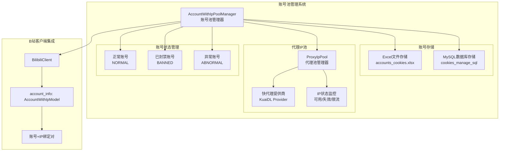
```mermaid
graph TB
    subgraph "账号池管理系统"
        A[AccountWithIpPoolManager<br/>账号池管理器]
        
        subgraph "账号存储"
            B[Excel文件存储<br/>accounts_cookies.xlsx]
            C[MySQL数据库存储<br/>cookies_manage_sql]
        end
        
        subgraph "代理IP池"
            D[ProxyIpPool<br/>代理池管理器]
            E[快代理提供商<br/>KuaiDL Provider]
            F[IP状态监控<br/>可用/失效/限流]
        end
        
        subgraph "账号状态管理"
            G[正常账号<br/>NORMAL]
            H[已封禁账号<br/>BANNED]
            I[异常账号<br/>ABNORMAL]
        end
    end
    
    A --> B
    A --> C
    A --> D
    D --> E
    D --> F
    
    A --> G
    A --> H
    A --> I
    
    subgraph "B站客户端集成"
        J[BilibiliClient]
        K[account_info: AccountWithIpModel]
        L[账号+IP绑定对]
    end
    
    A --> J
    J --> K
    K --> L
```

### 4.2 账号轮换流程

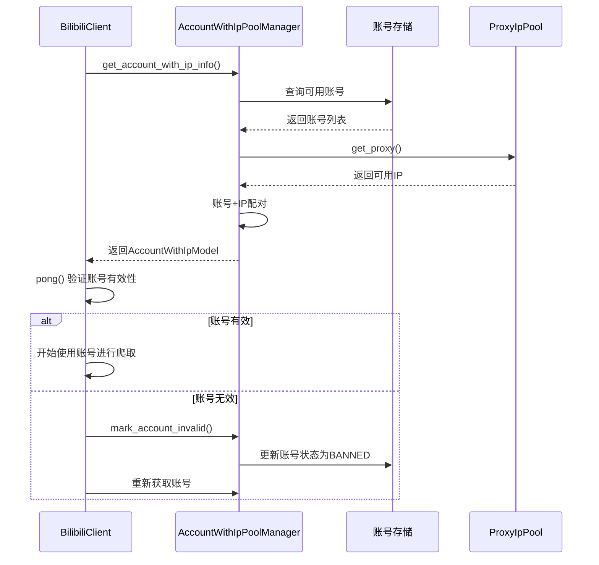
```mermaid
sequenceDiagram
    participant Client as BilibiliClient
    participant Pool as AccountWithIpPoolManager
    participant DB as 账号存储
    participant Proxy as ProxyIpPool
    
    Client->>Pool: get_account_with_ip_info()
    Pool->>DB: 查询可用账号
    DB-->>Pool: 返回账号列表
    Pool->>Proxy: get_proxy()
    Proxy-->>Pool: 返回可用IP
    Pool->>Pool: 账号+IP配对
    Pool-->>Client: 返回AccountWithIpModel
    
    Client->>Client: pong() 验证账号有效性
    
    alt 账号有效
        Client->>Client: 开始使用账号进行爬取
    else 账号无效
        Client->>Pool: mark_account_invalid()
        Pool->>DB: 更新账号状态为BANNED
        Client->>Pool: 重新获取账号
    end
```

### 4.3 IP代理管理

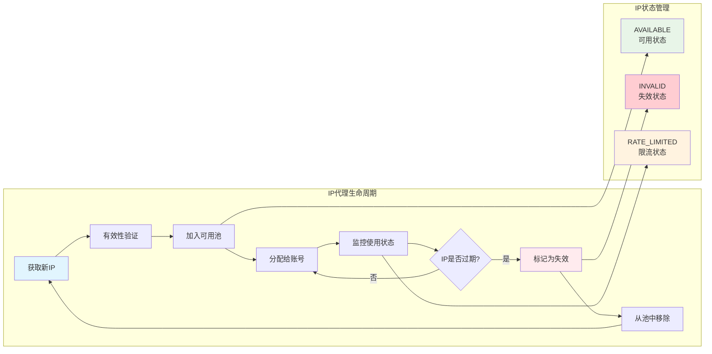
```mermaid
graph LR
    subgraph "IP代理生命周期"
        A[获取新IP] --> B[有效性验证]
        B --> C[加入可用池]
        C --> D[分配给账号]
        D --> E[监控使用状态]
        E --> F{IP是否过期?}
        F -->|否| D
        F -->|是| G[标记为失效]
        G --> H[从池中移除]
        H --> A
    end
    
    subgraph "IP状态管理"
        I[AVAILABLE<br/>可用状态]
        J[INVALID<br/>失效状态]
        K[RATE_LIMITED<br/>限流状态]
    end
    
    C --> I
    G --> J
    E --> K
    
    style A fill:#e1f5fe
    style G fill:#ffebee
    style I fill:#e8f5e8
    style J fill:#ffcdd2
    style K fill:#fff3e0
```

## 5. 请求签名机制详解

### 5.1 B站签名服务调用流程

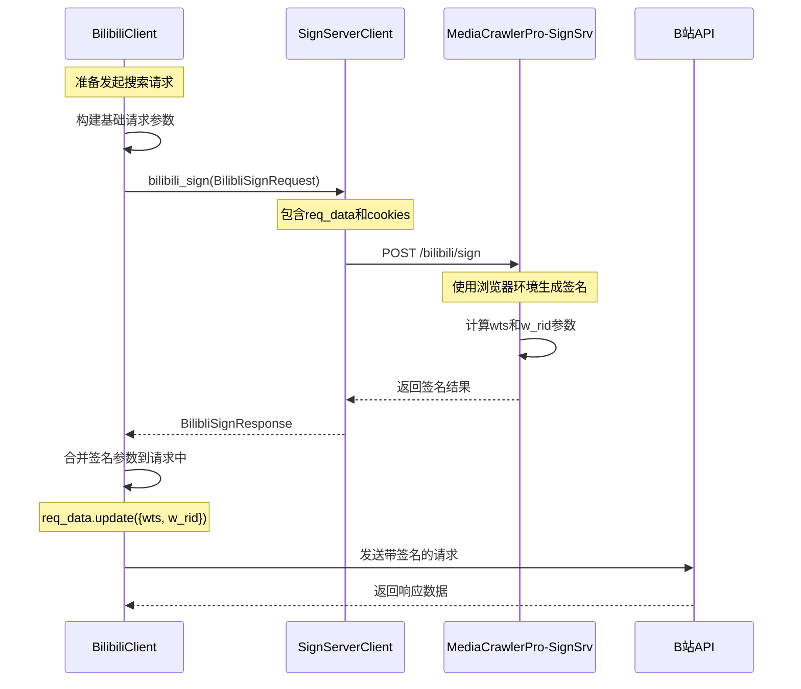
```mermaid
sequenceDiagram
    participant Client as BilibiliClient
    participant SignClient as SignServerClient
    participant SignSrv as MediaCrawlerPro-SignSrv
    participant BiliAPI as B站API
    
    Note over Client: 准备发起搜索请求
    Client->>Client: 构建基础请求参数
    
    Client->>SignClient: bilibili_sign(BilibliSignRequest)
    Note over SignClient: 包含req_data和cookies
    
    SignClient->>SignSrv: POST /bilibili/sign
    Note over SignSrv: 使用浏览器环境生成签名
    SignSrv->>SignSrv: 计算wts和w_rid参数
    SignSrv-->>SignClient: 返回签名结果
    
    SignClient-->>Client: BilibliSignResponse
    Client->>Client: 合并签名参数到请求中
    Note over Client: req_data.update({wts, w_rid})
    
    Client->>BiliAPI: 发送带签名的请求
    BiliAPI-->>Client: 返回响应数据
```

### 5.2 签名参数结构

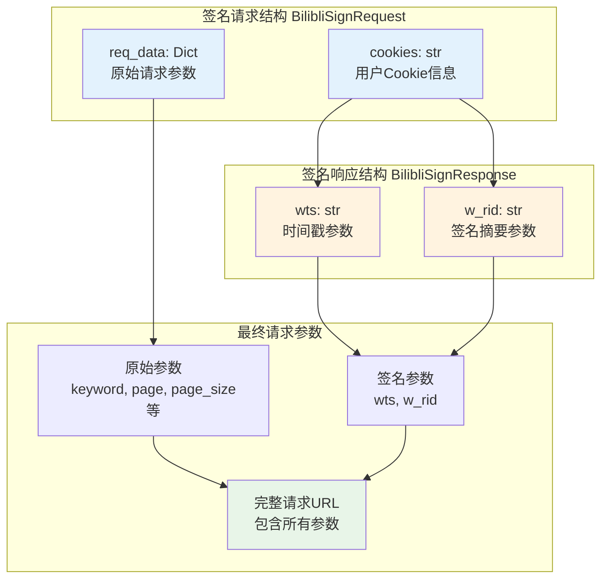
```mermaid
graph TB
    subgraph "签名请求结构 BilibliSignRequest"
        A[req_data: Dict<br/>原始请求参数]
        B[cookies: str<br/>用户Cookie信息]
    end
    
    subgraph "签名响应结构 BilibliSignResponse"
        C[wts: str<br/>时间戳参数]
        D[w_rid: str<br/>签名摘要参数]
    end
    
    subgraph "最终请求参数"
        E[原始参数<br/>keyword, page, page_size等]
        F[签名参数<br/>wts, w_rid]
        G[完整请求URL<br/>包含所有参数]
    end
    
    A --> E
    B --> C
    B --> D
    E --> G
    F --> G
    C --> F
    D --> F
    
    style A fill:#e3f2fd
    style B fill:#e3f2fd
    style C fill:#fff3e0
    style D fill:#fff3e0
    style G fill:#e8f5e8
```

### 5.3 签名验证失败处理

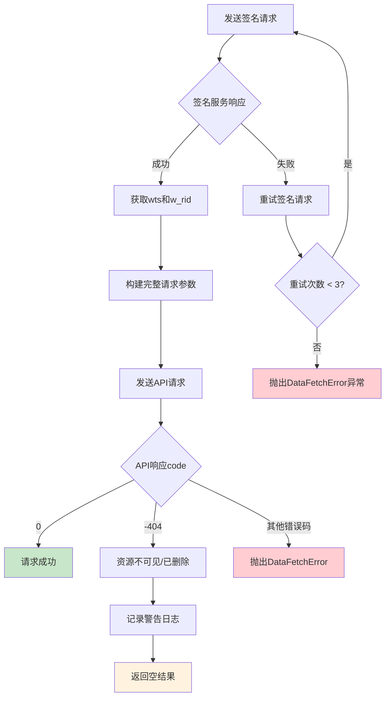
```mermaid
flowchart TD
    A[发送签名请求] --> B{签名服务响应}
    B -->|成功| C[获取wts和w_rid]
    B -->|失败| D[重试签名请求]
    D --> E{重试次数 < 3?}
    E -->|是| A
    E -->|否| F[抛出DataFetchError异常]
    
    C --> G[构建完整请求参数]
    G --> H[发送API请求]
    H --> I{API响应code}
    I -->|0| J[请求成功]
    I -->|-404| K[资源不可见/已删除]
    I -->|其他错误码| L[抛出DataFetchError]
    
    K --> M[记录警告日志]
    M --> N[返回空结果]
    
    style F fill:#ffcdd2
    style J fill:#c8e6c9
    style L fill:#ffcdd2
    style N fill:#fff3e0
```

## 6. 数据处理器架构

### 6.1 VideoProcessor视频处理器

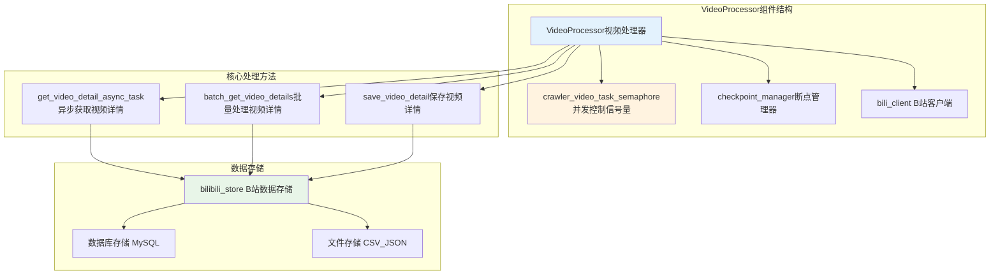
```mermaid
graph TB
    subgraph "VideoProcessor组件结构"
        A[VideoProcessor视频处理器]
        B[crawler_video_task_semaphore并发控制信号量]
        C[checkpoint_manager断点管理器]
        D[bili_client B站客户端]
    end
    
    subgraph "核心处理方法"
        E[get_video_detail_async_task异步获取视频详情]
        F[batch_get_video_details批量处理视频详情]
        G[save_video_detail保存视频详情]
    end
    
    subgraph "数据存储"
        H[bilibili_store B站数据存储]
        I[数据库存储 MySQL]
        J[文件存储 CSV_JSON]
    end
    
    A --> B
    A --> C
    A --> D
    A --> E
    A --> F
    A --> G
    
    E --> H
    F --> H
    G --> H
    
    H --> I
    H --> J
    
    style A fill:#e3f2fd
    style B fill:#fff3e0
    style H fill:#e8f5e8
```

### 6.2 CommentProcessor评论处理器

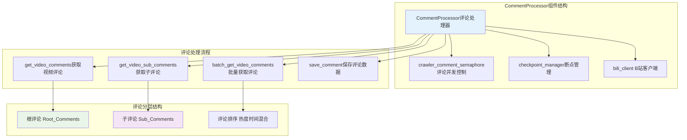
```mermaid
graph TB
    subgraph "CommentProcessor组件结构"
        A[CommentProcessor评论处理器]
        B[crawler_comment_semaphore评论并发控制]
        C[checkpoint_manager断点管理]
        D[bili_client B站客户端]
    end
    
    subgraph "评论处理流程"
        E[get_video_comments获取视频评论]
        F[get_video_sub_comments获取子评论]
        G[batch_get_video_comments批量获取评论]
        H[save_comment保存评论数据]
    end
    
    subgraph "评论分层结构"
        I[根评论 Root_Comments]
        J[子评论 Sub_Comments]
        K[评论排序 热度时间混合]
    end
    
    A --> B
    A --> C
    A --> D
    A --> E
    A --> F
    A --> G
    A --> H
    
    E --> I
    F --> J
    G --> K
    
    style A fill:#e3f2fd
    style I fill:#e8f5e8
    style J fill:#f3e5f5
```

### 6.3 数据处理并发控制

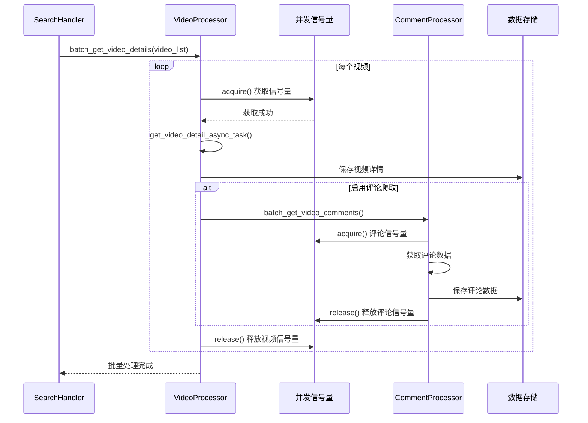
```mermaid
sequenceDiagram
    participant Handler as SearchHandler
    participant VideoProc as VideoProcessor
    participant Semaphore as 并发信号量
    participant CommentProc as CommentProcessor
    participant Store as 数据存储
    
    Handler->>VideoProc: batch_get_video_details(video_list)
    
    loop 每个视频
        VideoProc->>Semaphore: acquire() 获取信号量
        Semaphore-->>VideoProc: 获取成功
        
        VideoProc->>VideoProc: get_video_detail_async_task()
        VideoProc->>Store: 保存视频详情
        
        alt 启用评论爬取
            VideoProc->>CommentProc: batch_get_video_comments()
            CommentProc->>Semaphore: acquire() 评论信号量
            CommentProc->>CommentProc: 获取评论数据
            CommentProc->>Store: 保存评论数据
            CommentProc->>Semaphore: release() 释放评论信号量
        end
        
        VideoProc->>Semaphore: release() 释放视频信号量
    end
    
    VideoProc-->>Handler: 批量处理完成
```

## 7. Handler处理器模式分析

### 7.1 Handler继承结构

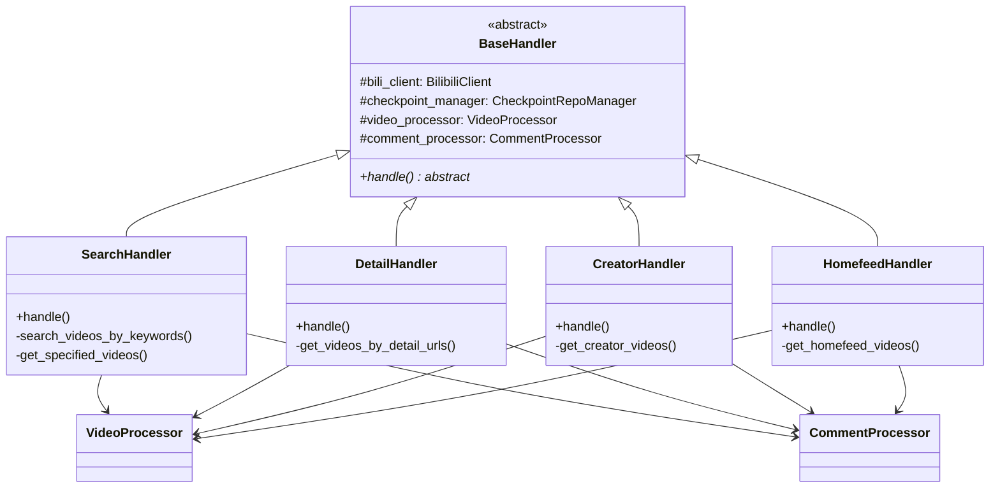
```mermaid
classDiagram
    class BaseHandler {
        <<abstract>>
        #bili_client: BilibiliClient
        #checkpoint_manager: CheckpointRepoManager
        #video_processor: VideoProcessor
        #comment_processor: CommentProcessor
        +handle()* abstract
    }
    
    class SearchHandler {
        +handle()
        -search_videos_by_keywords()
        -get_specified_videos()
    }
    
    class DetailHandler {
        +handle()
        -get_videos_by_detail_urls()
    }
    
    class CreatorHandler {
        +handle()
        -get_creator_videos()
    }
    
    class HomefeedHandler {
        +handle()
        -get_homefeed_videos()
    }
    
    BaseHandler <|-- SearchHandler
    BaseHandler <|-- DetailHandler
    BaseHandler <|-- CreatorHandler
    BaseHandler <|-- HomefeedHandler
    
    SearchHandler --> VideoProcessor
    SearchHandler --> CommentProcessor
    DetailHandler --> VideoProcessor
    DetailHandler --> CommentProcessor
    CreatorHandler --> VideoProcessor
    CreatorHandler --> CommentProcessor
    HomefeedHandler --> VideoProcessor
    HomefeedHandler --> CommentProcessor
```

### 7.2 策略模式的应用

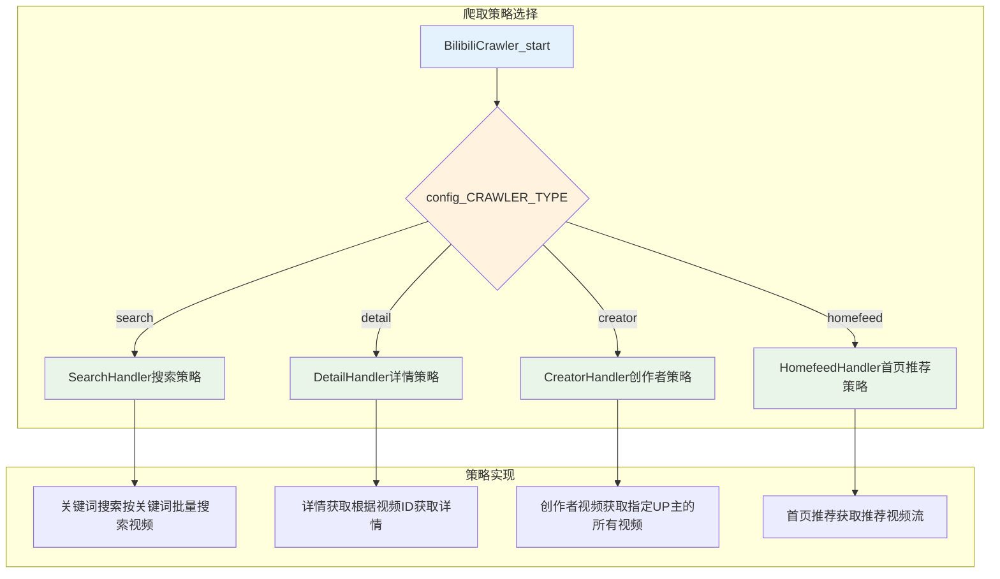
```mermaid
graph TB
    subgraph "爬取策略选择"
        A[BilibiliCrawler_start]
        B{config_CRAWLER_TYPE}
        C[SearchHandler搜索策略]
        D[DetailHandler详情策略]
        E[CreatorHandler创作者策略]
        F[HomefeedHandler首页推荐策略]
    end
    
    subgraph "策略实现"
        G[关键词搜索按关键词批量搜索视频]
        H[详情获取根据视频ID获取详情]
        I[创作者视频获取指定UP主的所有视频]
        J[首页推荐获取推荐视频流]
    end
    
    A --> B
    B -->|search| C
    B -->|detail| D
    B -->|creator| E
    B -->|homefeed| F
    
    C --> G
    D --> H
    E --> I
    F --> J
    
    style A fill:#e3f2fd
    style B fill:#fff3e0
    style C fill:#e8f5e8
    style D fill:#e8f5e8
    style E fill:#e8f5e8
    style F fill:#e8f5e8
```

## 8. 异常处理与容错机制

### 8.1 异常层次结构

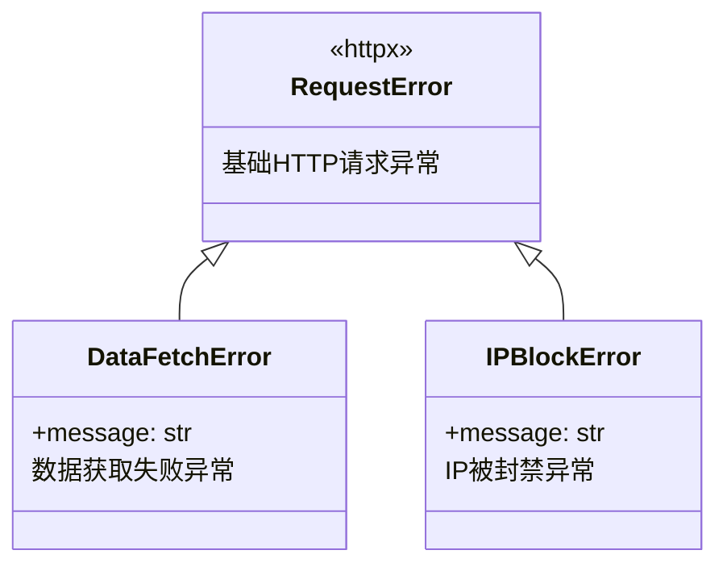
```mermaid
classDiagram
    class RequestError {
        <<httpx>>
        基础HTTP请求异常
    }
    
    class DataFetchError {
        +message: str
        数据获取失败异常
    }
    
    class IPBlockError {
        +message: str  
        IP被封禁异常
    }
    
    RequestError <|-- DataFetchError
    RequestError <|-- IPBlockError
```

### 8.2 容错处理流程

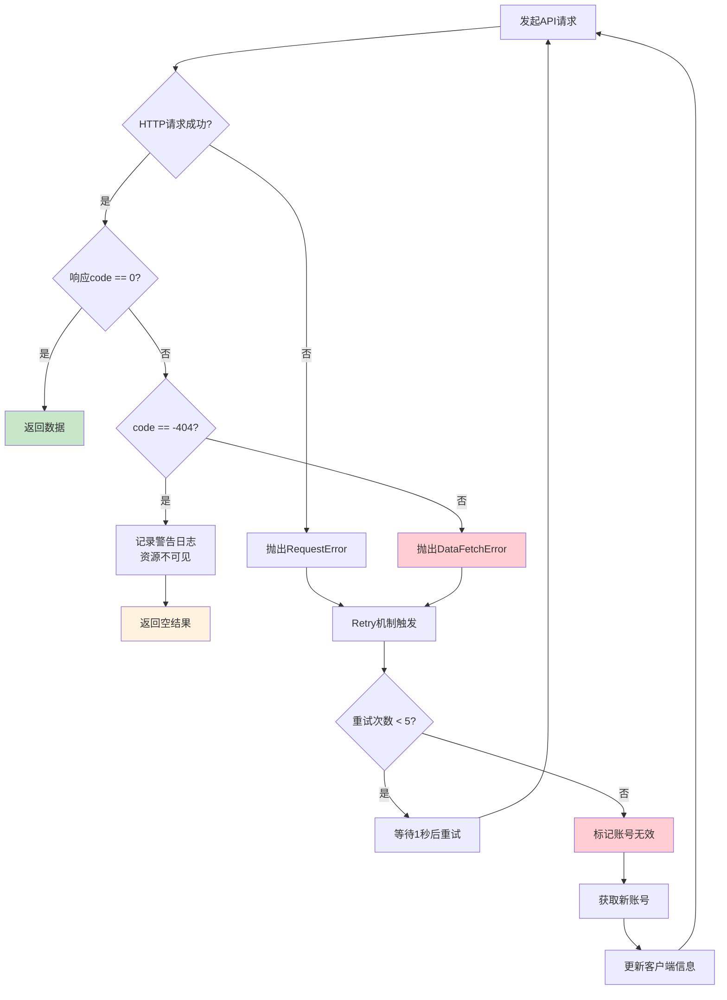
```mermaid
flowchart TD
    A[发起API请求] --> B{HTTP请求成功?}
    B -->|否| C[抛出RequestError]
    B -->|是| D{响应code == 0?}
    D -->|是| E[返回数据]
    D -->|否| F{code == -404?}
    F -->|是| G[记录警告日志<br/>资源不可见]
    F -->|否| H[抛出DataFetchError]
    G --> I[返回空结果]
    
    C --> J[Retry机制触发]
    H --> J
    J --> K{重试次数 < 5?}
    K -->|是| L[等待1秒后重试]
    K -->|否| M[标记账号无效]
    L --> A
    
    M --> N[获取新账号]
    N --> O[更新客户端信息]
    O --> A
    
    style E fill:#c8e6c9
    style I fill:#fff3e0
    style H fill:#ffcdd2
    style M fill:#ffcdd2
```

## 9. 断点续爬系统集成

### 9.1 断点数据结构

```mermaid
graph TB
    subgraph "断点信息结构"
        A[Checkpoint对象]
        B[platform: 'bilibili'<br/>平台标识]
        C[crawler_type: 'search'<br/>爬取类型]
        D[keyword: '搜索关键词'<br/>搜索条件]
        E[page: 当前页码<br/>进度信息]
        F[crawled_count: 已爬取数量<br/>统计信息]
        G[timestamp: 时间戳<br/>更新时间]
    end
    
    A --> B
    A --> C
    A --> D
    A --> E
    A --> F
    A --> G
    
    subgraph "断点存储"
        H[data/checkpoints/<br/>断点文件目录]
        I[bili_search_20250724.json<br/>具体断点文件]
    end
    
    A --> H
    H --> I
    
    style A fill:#e3f2fd
    style I fill:#e8f5e8
```

### 9.2 断点续爬流程

```mermaid
sequenceDiagram
    participant User as 用户
    participant Handler as SearchHandler
    participant CheckMgr as CheckpointManager
    participant Store as 断点存储
    
    User->>Handler: 启动爬虫
    Handler->>CheckMgr: 检查是否有断点
    CheckMgr->>Store: 读取断点文件
    
    alt 存在断点
        Store-->>CheckMgr: 返回断点信息
        CheckMgr-->>Handler: 恢复到断点位置
        Handler->>Handler: 从断点页码继续爬取
    else 不存在断点
        CheckMgr-->>Handler: 从头开始爬取
        Handler->>Handler: 从第1页开始爬取
    end
    
    loop 爬取过程中
        Handler->>CheckMgr: 更新进度
        CheckMgr->>Store: 保存断点信息
    end
    
    Handler->>CheckMgr: 爬取完成
    CheckMgr->>Store: 删除断点文件
```

## 10. 性能优化技术

### 10.1 并发控制策略

```mermaid
graph TB
    subgraph "并发控制层次"
        A[全局并发控制<br/>config.MAX_CONCURRENCY_NUM]
        B[视频任务信号量<br/>crawler_video_task_semaphore]
        C[评论任务信号量<br/>crawler_video_comment_semaphore]
    end
    
    subgraph "任务分配"
        D[视频详情获取任务]
        E[评论数据获取任务]
        F[创作者信息获取任务]
    end
    
    subgraph "资源保护"
        G[防止请求过快<br/>避免IP被封]
        H[数据库连接保护<br/>避免连接耗尽]
        I[内存使用控制<br/>避免内存溢出]
    end
    
    A --> B
    A --> C
    B --> D
    C --> E
    B --> F
    
    B --> G
    C --> H
    A --> I
    
    style A fill:#e3f2fd
    style G fill:#fff3e0
    style H fill:#fff3e0
    style I fill:#fff3e0
```

### 10.2 缓存优化策略

```mermaid
graph LR
    subgraph "缓存层次"
        A[内存缓存<br/>LocalCache]
        B[Redis缓存<br/>RedisCache]
        C[本地文件缓存<br/>断点文件]
    end
    
    subgraph "缓存内容"
        D[用户信息缓存<br/>UP主信息]
        E[请求响应缓存<br/>API响应数据]
        F[配置信息缓存<br/>系统配置]
        G[w_webid缓存<br/>12小时TTL]
    end
    
    A --> D
    A --> G
    B --> E
    B --> F
    C --> F
    
    subgraph "缓存策略"
        H[热点数据<br/>高频访问数据优先缓存]
        I[过期策略<br/>TTL时间控制]
        J[缓存穿透保护<br/>空值缓存]
    end
    
    D --> H
    E --> I
    F --> J
    
    style A fill:#e8f5e8
    style B fill:#e3f2fd
    style H fill:#fff3e0
```

## 11. 总结与最佳实践

### 11.1 架构设计优势

1. **模块化设计**: 各组件职责明确，易于维护和扩展
2. **面向对象**: 良好的继承和组合关系，代码复用性高
3. **策略模式**: 支持多种爬取策略，灵活切换
4. **容错机制**: 完善的异常处理和重试机制
5. **性能优化**: 并发控制和缓存策略提升效率

### 11.2 学习要点

```mermaid
mindmap
  root((B站爬虫<br/>学习要点))
    架构设计
      继承与组合
      策略模式应用
      依赖注入
      模块化设计
    网络编程
      HTTP客户端封装
      异步请求处理
      重试机制实现
      代理IP管理
    数据处理
      数据提取与清洗
      批量处理优化
      并发控制
      存储抽象
    系统设计
      账号池管理
      断点续爬
      签名服务集成
      监控与日志
```

### 11.3 代码规范要点

1. **类型注解**: 使用TYPE_CHECKING避免循环导入
2. **异步编程**: 合理使用async/await提升性能
3. **异常处理**: 明确的异常层次和处理策略
4. **配置管理**: 集中化配置，支持环境变量
5. **日志记录**: 详细的日志记录便于调试和监控

---

**再次提醒：本项目仅供学习和研究目的使用，请严格遵守相关法律法规和平台使用条款，不得用于任何商业用途或违法行为。**