# 4. 平台存储系统深度解析

## ⚠️ 重要声明

**本项目仅供学习和研究目的使用**，使用者应严格遵守以下原则：

1. **不得用于任何商业用途**
2. 使用时应遵守目标平台的使用条款和robots.txt规则
3. 不得进行大规模爬取或对平台造成运营干扰
4. 应合理控制请求频率，避免给目标平台带来不必要的负担
5. 不得用于任何非法或不当的用途

详细许可条款请参阅项目根目录下的 [LICENSE](../LICENSE) 文件。

---

## 1. 存储系统整体架构

### 1.1 存储层架构概览

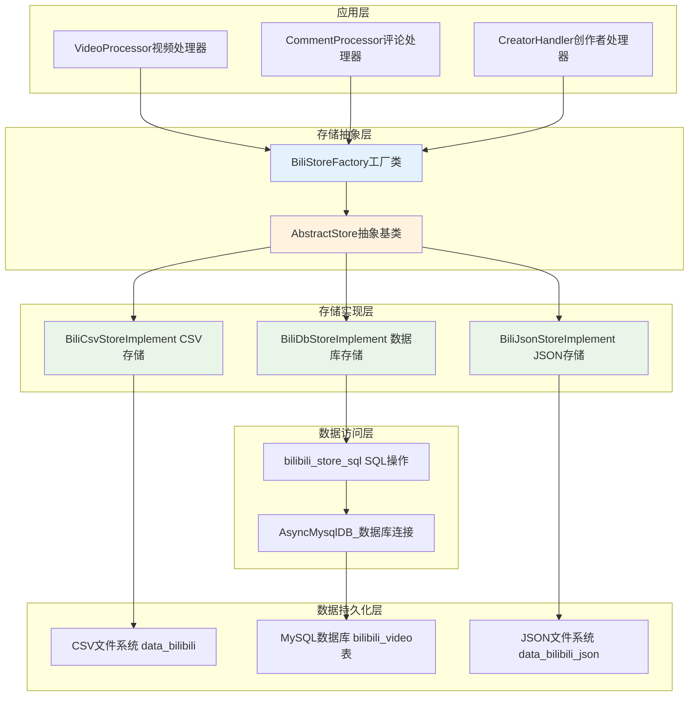

### 1.2 存储策略选择机制

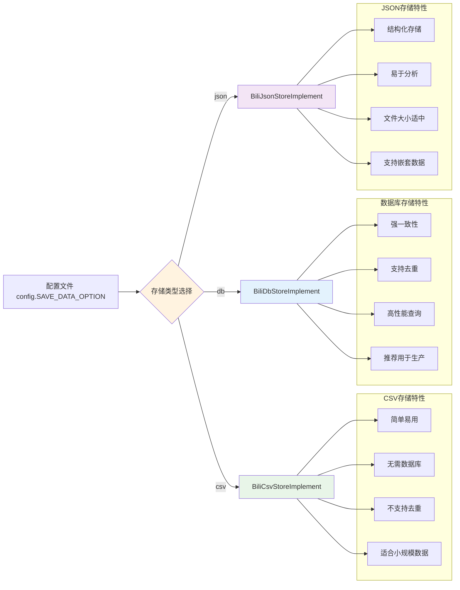

## 2. 抽象设计模式分析

### 2.1 AbstractStore抽象基类

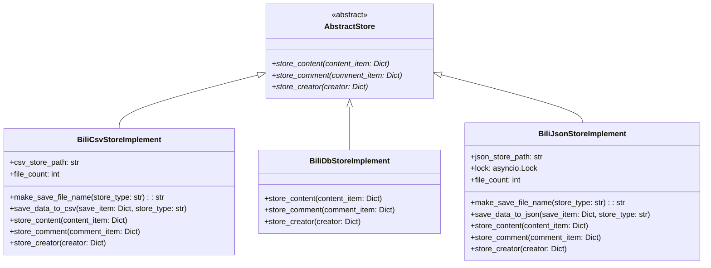

### 2.2 工厂模式实现

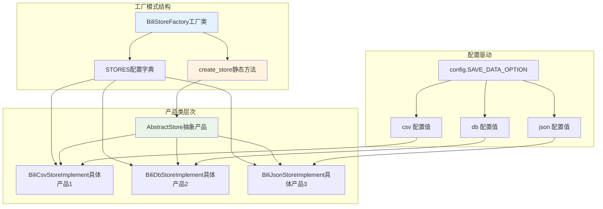

## 3. CSV存储实现深度分析

### 3.1 CSV存储架构

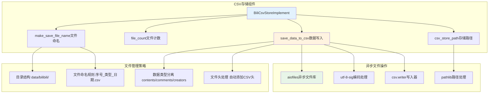

### 3.2 CSV文件命名与组织

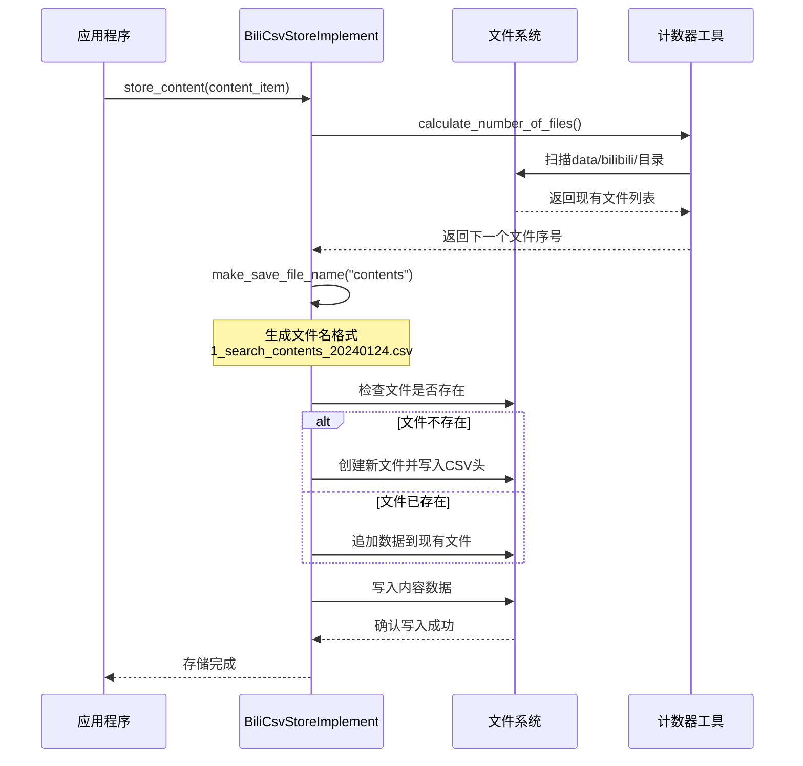

### 3.3 CSV数据格式示例

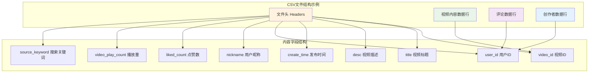

## 4. 数据库存储实现深度分析

### 4.1 数据库存储架构

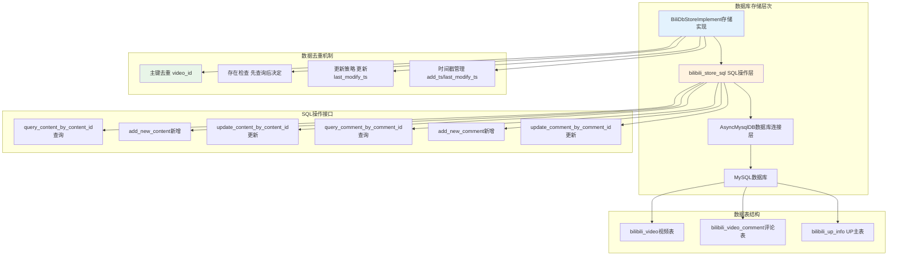

### 4.2 数据库去重流程

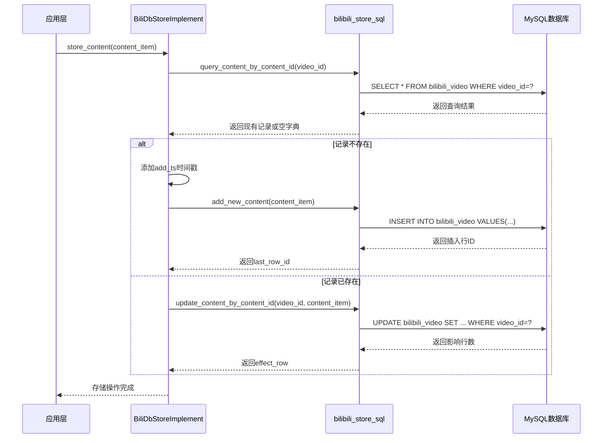

### 4.3 数据库表结构设计

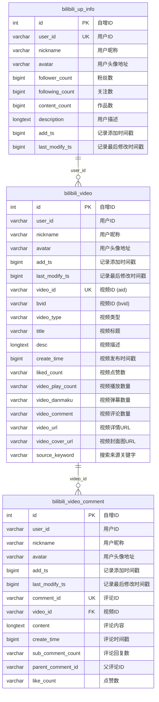

## 5. JSON存储实现深度分析

### 5.1 JSON存储架构

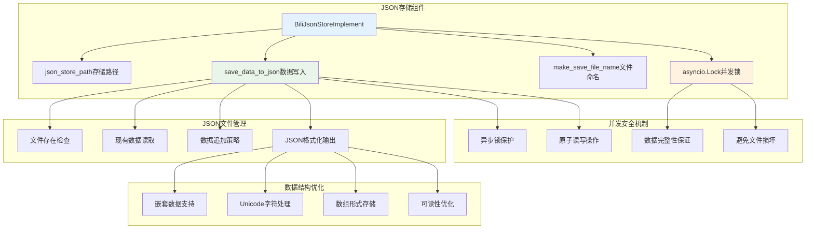

### 5.2 JSON并发写入流程

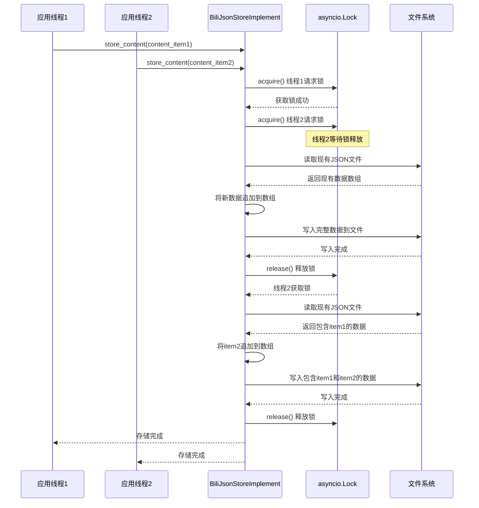

### 5.3 JSON数据结构示例

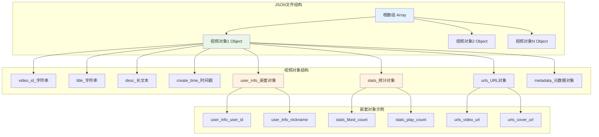

## 7. 存储系统扩展性设计

### 7.1 多平台存储架构

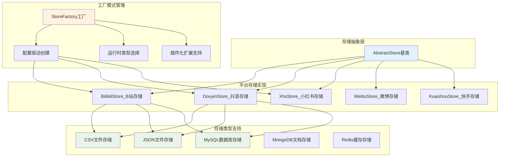

### 7.2 新存储类型集成

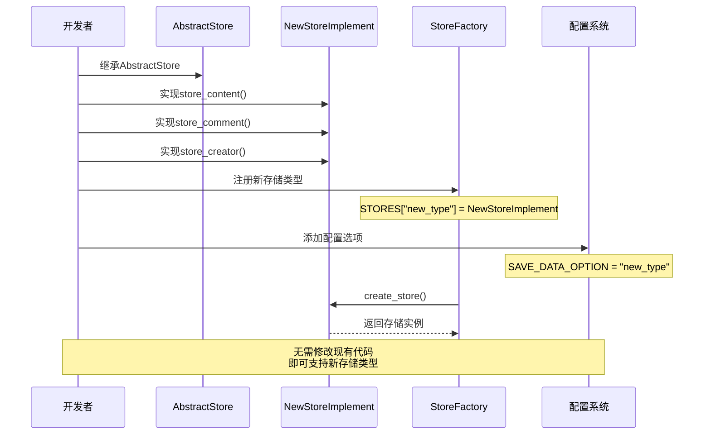

## 8. 最佳实践与总结

建议都选择DB存储，因为DB存储支持去重，并且支持复杂查询

### 8.2 系统设计优势

1. **抽象设计**: 统一的存储接口，支持多种存储后端
2. **工厂模式**: 配置驱动的存储类型选择，易于扩展
3. **数据去重**: 数据库存储支持自动去重，避免重复数据
4. **异步操作**: 全异步IO操作，提升系统性能
5. **并发安全**: 完善的锁机制和事务处理
6. **错误处理**: 完备的异常处理和恢复机制

### 10.3 学习要点总结

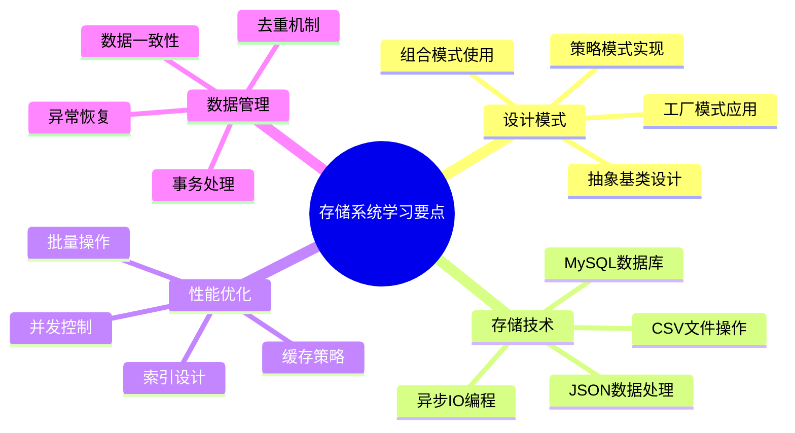

---

**再次提醒：本项目仅供学习和研究目的使用，请严格遵守相关法律法规和平台使用条款，不得用于任何商业用途或违法行为。通过学习本存储系统，您可以深入理解现代爬虫系统的数据持久化设计模式和最佳实践。**