# 5. 多账号和IP系统深度解析

## ⚠️ 重要声明

**本项目仅供学习和研究目的使用**，使用者应严格遵守以下原则：

1. **不得用于任何商业用途**
2. 使用时应遵守目标平台的使用条款和robots.txt规则
3. 不得进行大规模爬取或对平台造成运营干扰
4. 应合理控制请求频率，避免给目标平台带来不必要的负担
5. 不得用于任何非法或不当的用途

详细许可条款请参阅项目根目录下的 [LICENSE](../LICENSE) 文件。

---

## 1. 多账号和IP系统整体架构

### 1.1 系统架构概览

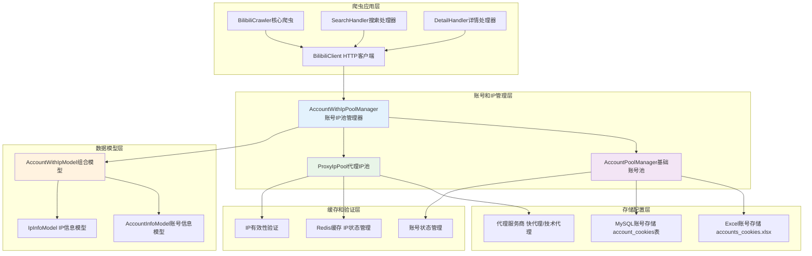
```mermaid
graph TB
    subgraph "爬虫应用层"
        A[BilibiliCrawler核心爬虫]
        B[BilibiliClient HTTP客户端]
        C[SearchHandler搜索处理器]
        D[DetailHandler详情处理器]
    end
    
    subgraph "账号和IP管理层"
        E[AccountWithIpPoolManager账号IP池管理器]
        F[AccountPoolManager基础账号池]
        G[ProxyIpPool代理IP池]
    end
    
    subgraph "数据模型层"
        H[AccountWithIpModel组合模型]
        I[AccountInfoModel账号信息模型]
        J[IpInfoModel IP信息模型]
    end
    
    subgraph "存储配置层"
        K[Excel账号存储 accounts_cookies.xlsx]
        L[MySQL账号存储 account_cookies表]
        M[代理服务商 快代理/技术代理]
    end
    
    subgraph "缓存和验证层"
        N[Redis缓存 IP状态管理]
        O[IP有效性验证]
        P[账号状态管理]
    end
    
    A --> B
    B --> E
    C --> B
    D --> B
    
    E --> F
    E --> G
    E --> H
    
    H --> I
    H --> J
    
    F --> K
    F --> L
    G --> M
    
    G --> N
    G --> O
    F --> P
    
    style E fill:#e3f2fd
    style H fill:#fff3e0
    style G fill:#e8f5e8
    style F fill:#f3e5f5
```

### 1.2 核心设计模式

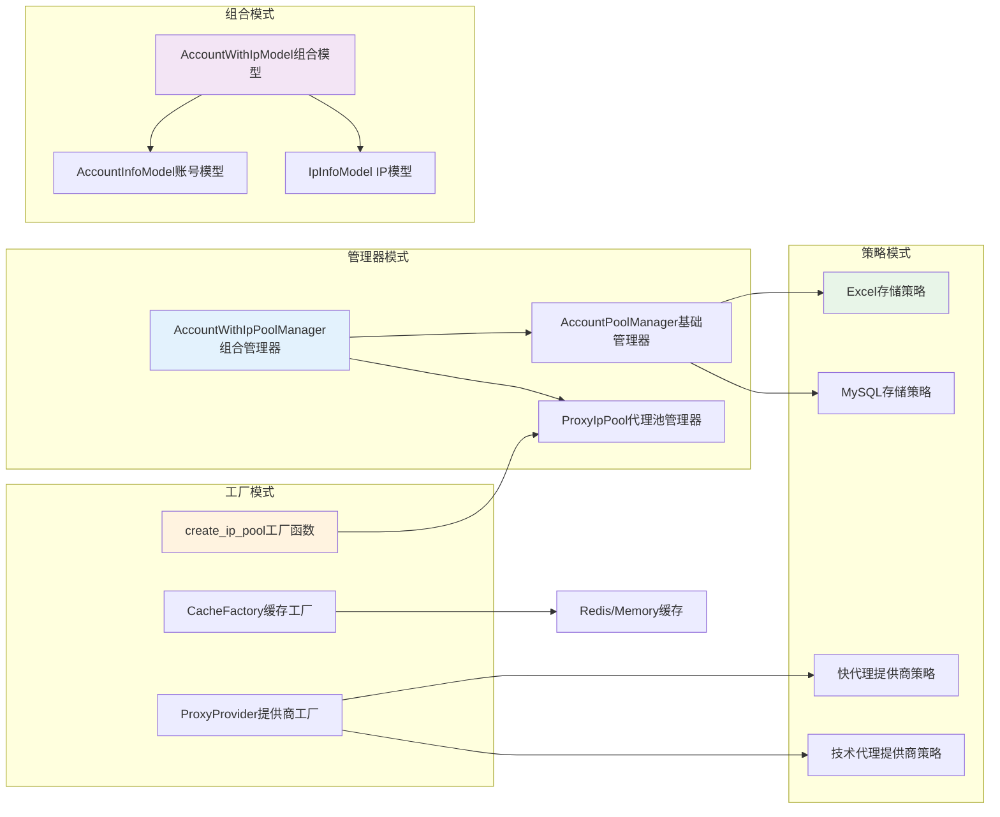
```mermaid
graph LR
    subgraph "管理器模式"
        A[AccountWithIpPoolManager组合管理器]
        B[AccountPoolManager基础管理器]
        C[ProxyIpPool代理池管理器]
    end
    
    subgraph "工厂模式"
        D[create_ip_pool工厂函数]
        E[CacheFactory缓存工厂]
        F[ProxyProvider提供商工厂]
    end
    
    subgraph "策略模式"
        G[Excel存储策略]
        H[MySQL存储策略]
        I[快代理提供商策略]
        J[技术代理提供商策略]
    end
    
    subgraph "组合模式"
        K[AccountWithIpModel组合模型]
        L[AccountInfoModel账号模型]
        M[IpInfoModel IP模型]
    end
    
    A --> B
    A --> C
    
    D --> C
    E --> N[Redis/Memory缓存]
    F --> I
    F --> J
    
    B --> G
    B --> H
    
    K --> L
    K --> M
    
    style A fill:#e3f2fd
    style D fill:#fff3e0
    style G fill:#e8f5e8
    style K fill:#f3e5f5
```

## 2. 账号池系统深度分析

### 2.1 账号池核心架构

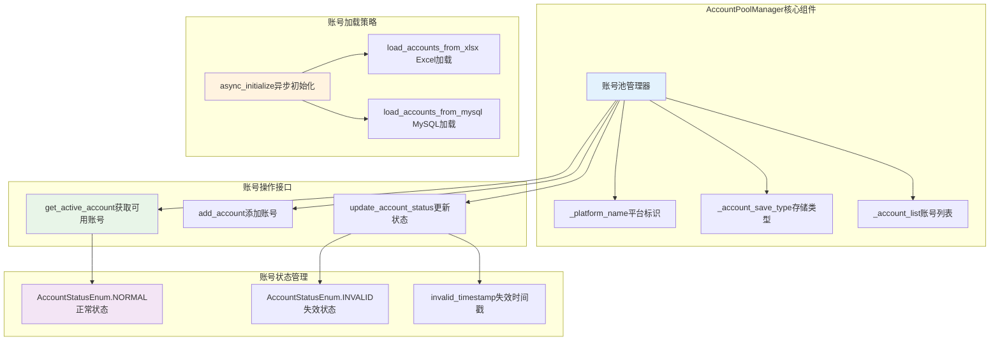
```mermaid
graph TB
    subgraph "AccountPoolManager核心组件"
        A[账号池管理器]
        B[_platform_name平台标识]
        C[_account_save_type存储类型]
        D[_account_list账号列表]
    end
    
    subgraph "账号加载策略"
        E[load_accounts_from_xlsx Excel加载]
        F[load_accounts_from_mysql MySQL加载]
        G[async_initialize异步初始化]
    end
    
    subgraph "账号操作接口"
        H[get_active_account获取可用账号]
        I[add_account添加账号]
        J[update_account_status更新状态]
    end
    
    subgraph "账号状态管理"
        K[AccountStatusEnum.NORMAL正常状态]
        L[AccountStatusEnum.INVALID失效状态]
        M[invalid_timestamp失效时间戳]
    end
    
    A --> B
    A --> C
    A --> D
    
    G --> E
    G --> F
    
    A --> H
    A --> I
    A --> J
    
    H --> K
    J --> L
    J --> M
    
    style A fill:#e3f2fd
    style G fill:#fff3e0
    style H fill:#e8f5e8
    style K fill:#f3e5f5
```

### 2.2 账号数据模型设计

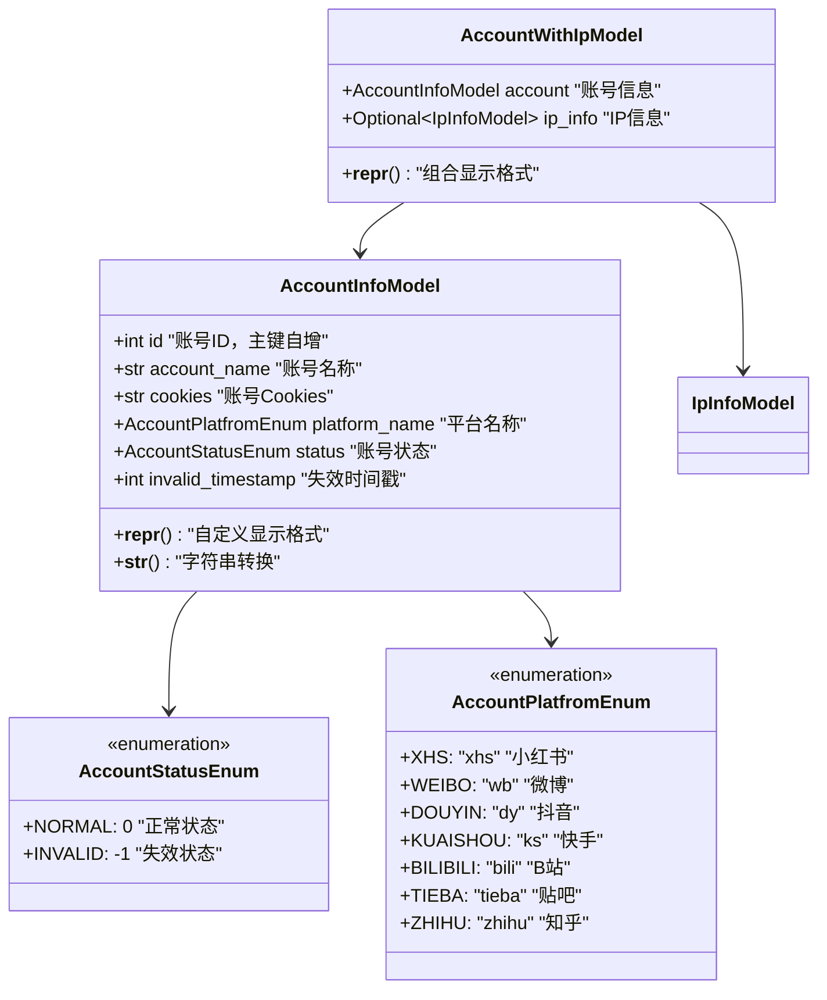
```mermaid
classDiagram
    class AccountInfoModel {
        +int id "账号ID，主键自增"
        +str account_name "账号名称"
        +str cookies "账号Cookies"
        +AccountPlatfromEnum platform_name "平台名称"
        +AccountStatusEnum status "账号状态"
        +int invalid_timestamp "失效时间戳"
        +__repr__() "自定义显示格式"
        +__str__() "字符串转换"
    }
    
    class AccountStatusEnum {
        <<enumeration>>
        +NORMAL: 0 "正常状态"
        +INVALID: -1 "失效状态"
    }
    
    class AccountPlatfromEnum {
        <<enumeration>>
        +XHS: "xhs" "小红书"
        +WEIBO: "wb" "微博"
        +DOUYIN: "dy" "抖音"
        +KUAISHOU: "ks" "快手"
        +BILIBILI: "bili" "B站"
        +TIEBA: "tieba" "贴吧"
        +ZHIHU: "zhihu" "知乎"
    }
    
    class AccountWithIpModel {
        +AccountInfoModel account "账号信息"
        +Optional~IpInfoModel~ ip_info "IP信息"
        +__repr__() "组合显示格式"
    }
    
    AccountInfoModel --> AccountStatusEnum
    AccountInfoModel --> AccountPlatfromEnum
    AccountWithIpModel --> AccountInfoModel
    AccountWithIpModel --> IpInfoModel
```

### 2.3 账号加载流程

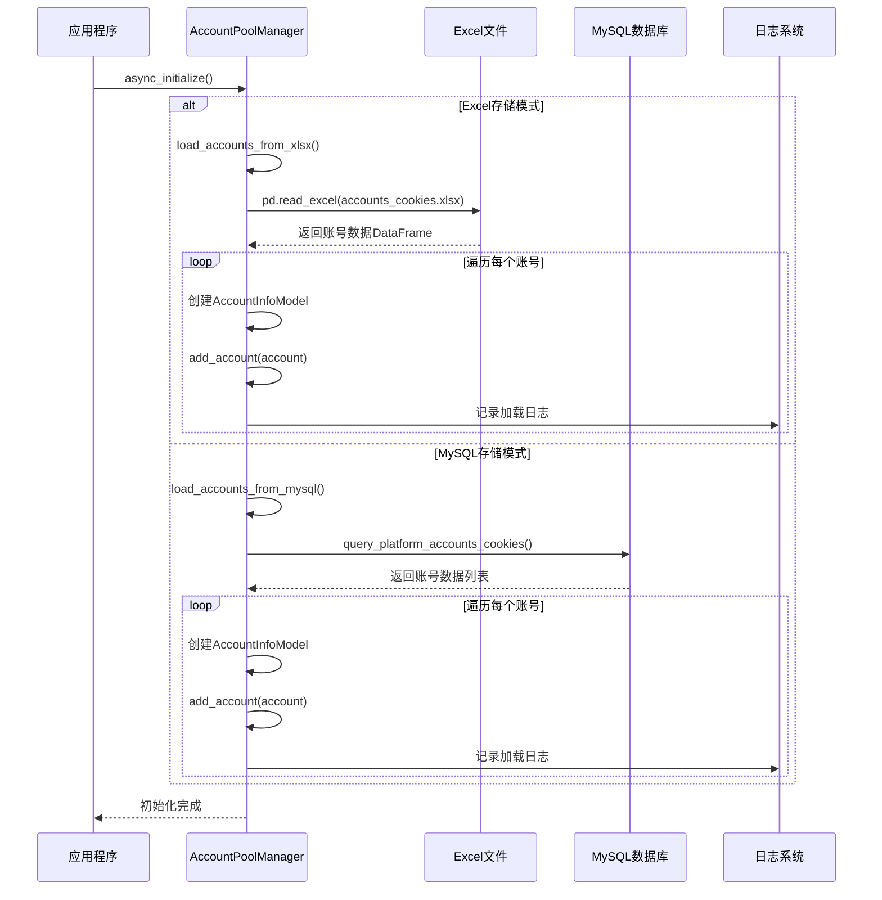
```mermaid
sequenceDiagram
    participant App as 应用程序
    participant Manager as AccountPoolManager
    participant Excel as Excel文件
    participant MySQL as MySQL数据库
    participant Logger as 日志系统
    
    App->>Manager: async_initialize()
    
    alt Excel存储模式
        Manager->>Manager: load_accounts_from_xlsx()
        Manager->>Excel: pd.read_excel(accounts_cookies.xlsx)
        Excel-->>Manager: 返回账号数据DataFrame
        
        loop 遍历每个账号
            Manager->>Manager: 创建AccountInfoModel
            Manager->>Manager: add_account(account)
            Manager->>Logger: 记录加载日志
        end
        
    else MySQL存储模式
        Manager->>Manager: load_accounts_from_mysql()
        Manager->>MySQL: query_platform_accounts_cookies()
        MySQL-->>Manager: 返回账号数据列表
        
        loop 遍历每个账号
            Manager->>Manager: 创建AccountInfoModel
            Manager->>Manager: add_account(account)
            Manager->>Logger: 记录加载日志
        end
    end
    
    Manager-->>App: 初始化完成
```

### 2.4 账号状态管理机制

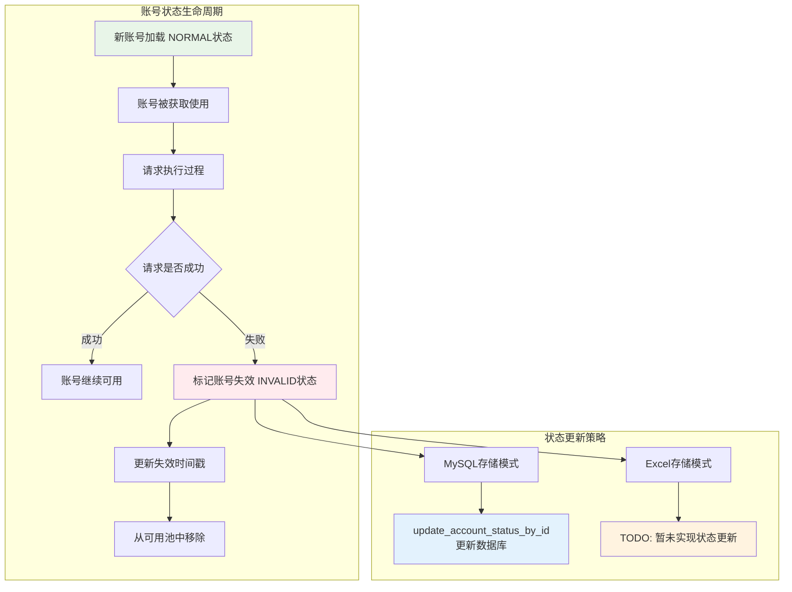
```mermaid
graph TB
    subgraph "账号状态生命周期"
        A[新账号加载 NORMAL状态]
        B[账号被获取使用]
        C[请求执行过程]
        D{请求是否成功}
        E[账号继续可用]
        F[标记账号失效 INVALID状态]
        G[更新失效时间戳]
        H[从可用池中移除]
    end
    
    subgraph "状态更新策略"
        I[MySQL存储模式]
        J[update_account_status_by_id更新数据库]
        K[Excel存储模式]
        L[TODO: 暂未实现状态更新]
    end
    
    A --> B
    B --> C
    C --> D
    D -->|成功| E
    D -->|失败| F
    F --> G
    G --> H
    
    F --> I
    F --> K
    I --> J
    K --> L
    
    style A fill:#e8f5e8
    style F fill:#ffebee
    style J fill:#e3f2fd
    style L fill:#fff3e0
```

## 3. 代理IP系统深度分析

### 3.1 代理IP池核心架构

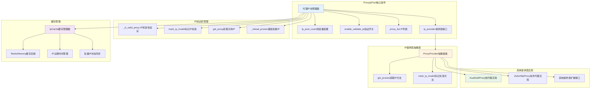
```mermaid
graph TB
    subgraph "ProxyIpPool核心组件"
        A[代理IP池管理器]
        B[ip_pool_count池容量配置]
        C[enable_validate_ip验证开关]
        D[proxy_list IP列表]
        E[ip_provider提供商接口]
    end
    
    subgraph "IP提供商抽象层"
        F[ProxyProvider抽象基类]
        G[get_proxies获取IP方法]
        H[mark_ip_invalid标记失效方法]
    end
    
    subgraph "具体提供商实现"
        I[KuaiDailiProxy快代理实现]
        J[JishuHttpProxy技术代理实现]
        K[其他提供商扩展接口]
    end
    
    subgraph "IP验证和管理"
        L[_is_valid_proxy IP有效性验证]
        M[mark_ip_invalid标记IP失效]
        N[get_proxy获取可用IP]
        O[_reload_proxies重新加载IP]
    end
    
    subgraph "缓存管理"
        P[IpCache缓存管理器]
        Q[Redis/Memory缓存后端]
        R[IP过期时间管理]
        S[批量IP状态同步]
    end
    
    A --> B
    A --> C
    A --> D
    A --> E
    
    E --> F
    F --> G
    F --> H
    
    F --> I
    F --> J
    F --> K
    
    A --> L
    A --> M
    A --> N
    A --> O
    
    A --> P
    P --> Q
    P --> R
    P --> S
    
    style A fill:#e3f2fd
    style F fill:#fff3e0
    style I fill:#e8f5e8
    style P fill:#f3e5f5
```

### 3.2 IP数据模型和验证

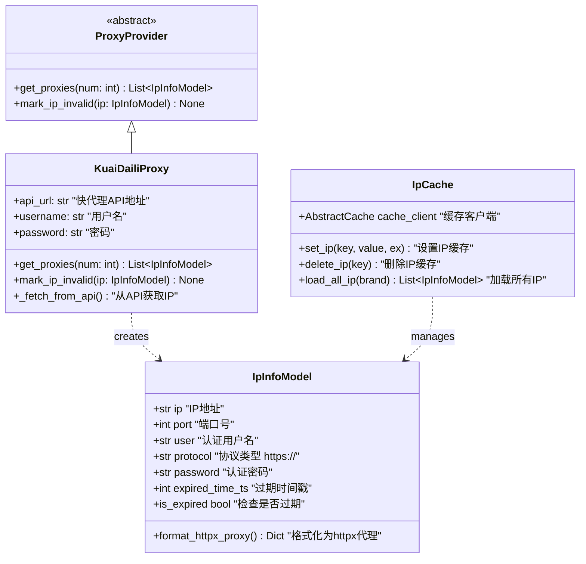
```mermaid
classDiagram
    class IpInfoModel {
        +str ip "IP地址"
        +int port "端口号"
        +str user "认证用户名"
        +str protocol "协议类型 https://"
        +str password "认证密码"
        +int expired_time_ts "过期时间戳"
        +format_httpx_proxy() Dict "格式化为httpx代理"
        +is_expired bool "检查是否过期"
    }
    
    class ProxyProvider {
        <<abstract>>
        +get_proxies(num: int) List~IpInfoModel~
        +mark_ip_invalid(ip: IpInfoModel) None
    }
    
    class KuaiDailiProxy {
        +api_url: str "快代理API地址"
        +username: str "用户名"
        +password: str "密码"
        +get_proxies(num: int) List~IpInfoModel~
        +mark_ip_invalid(ip: IpInfoModel) None
        +_fetch_from_api() "从API获取IP"
    }
    
    class IpCache {
        +AbstractCache cache_client "缓存客户端"
        +set_ip(key, value, ex) "设置IP缓存"
        +delete_ip(key) "删除IP缓存"
        +load_all_ip(brand) List~IpInfoModel~ "加载所有IP"
    }
    
    ProxyProvider <|-- KuaiDailiProxy
    KuaiDailiProxy ..> IpInfoModel : creates
    IpCache ..> IpInfoModel : manages
```

### 3.3 IP获取和验证流程

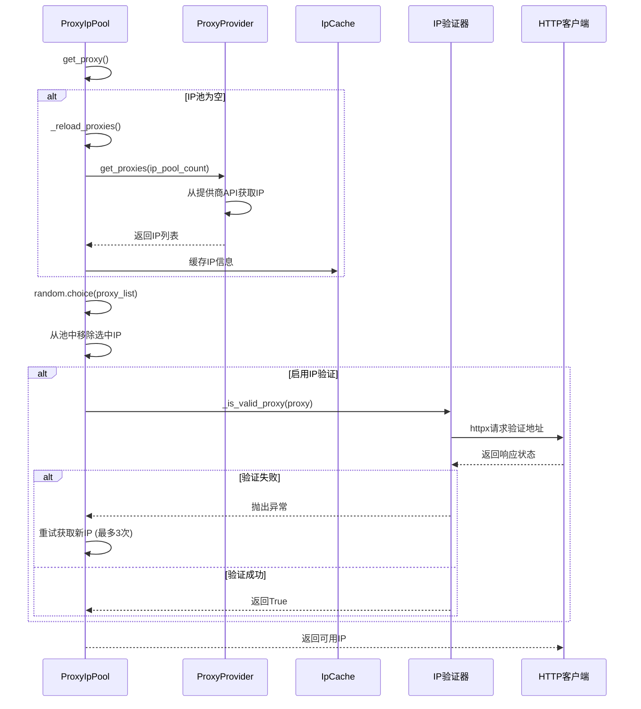
```mermaid
sequenceDiagram
    participant Pool as ProxyIpPool
    participant Provider as ProxyProvider
    participant Cache as IpCache
    participant Validator as IP验证器
    participant Client as HTTP客户端
    
    Pool->>Pool: get_proxy()
    
    alt IP池为空
        Pool->>Pool: _reload_proxies()
        Pool->>Provider: get_proxies(ip_pool_count)
        Provider->>Provider: 从提供商API获取IP
        Provider-->>Pool: 返回IP列表
        Pool->>Cache: 缓存IP信息
    end
    
    Pool->>Pool: random.choice(proxy_list)
    Pool->>Pool: 从池中移除选中IP
    
    alt 启用IP验证
        Pool->>Validator: _is_valid_proxy(proxy)
        Validator->>Client: httpx请求验证地址
        Client-->>Validator: 返回响应状态
        
        alt 验证失败
            Validator-->>Pool: 抛出异常
            Pool->>Pool: 重试获取新IP (最多3次)
        else 验证成功
            Validator-->>Pool: 返回True
        end
    end
    
    Pool-->>Client: 返回可用IP
```

### 3.4 IP池管理和轮换策略

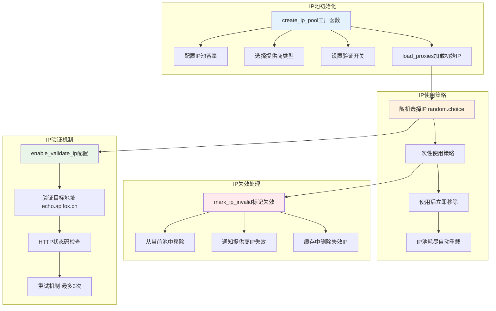
```mermaid
graph TB
    subgraph "IP池初始化"
        A[create_ip_pool工厂函数]
        B[配置IP池容量]
        C[选择提供商类型]
        D[设置验证开关]
        E[load_proxies加载初始IP]
    end
    
    subgraph "IP使用策略"
        F[随机选择IP random.choice]
        G[一次性使用策略]
        H[使用后立即移除]
        I[IP池耗尽自动重载]
    end
    
    subgraph "IP失效处理"
        J[mark_ip_invalid标记失效]
        K[从当前池中移除]
        L[通知提供商IP失效]
        M[缓存中删除失效IP]
    end
    
    subgraph "IP验证机制"
        N[enable_validate_ip配置]
        O[验证目标地址 echo.apifox.cn]
        P[HTTP状态码检查]
        Q[重试机制 最多3次]
    end
    
    A --> B
    A --> C
    A --> D
    A --> E
    
    E --> F
    F --> G
    G --> H
    H --> I
    
    G --> J
    J --> K
    J --> L
    J --> M
    
    F --> N
    N --> O
    O --> P
    P --> Q
    
    style A fill:#e3f2fd
    style F fill:#fff3e0
    style J fill:#ffebee
    style N fill:#e8f5e8
```

## 4. 账号与IP组合管理

### 4.1 AccountWithIpPoolManager架构

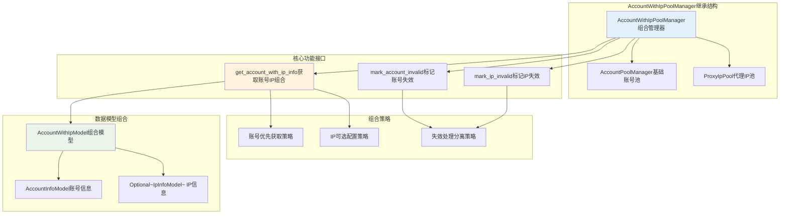
```mermaid
graph TB
    subgraph "AccountWithIpPoolManager继承结构"
        A[AccountWithIpPoolManager组合管理器]
        B[AccountPoolManager基础账号池]
        C[ProxyIpPool代理IP池]
    end
    
    subgraph "核心功能接口"
        D[get_account_with_ip_info获取账号IP组合]
        E[mark_account_invalid标记账号失效]
        F[mark_ip_invalid标记IP失效]
    end
    
    subgraph "组合策略"
        G[账号优先获取策略]
        H[IP可选配置策略]
        I[失效处理分离策略]
    end
    
    subgraph "数据模型组合"
        J[AccountWithIpModel组合模型]
        K[AccountInfoModel账号信息]
        L[Optional~IpInfoModel~ IP信息]
    end
    
    A --> B
    A --> C
    
    A --> D
    A --> E
    A --> F
    
    D --> G
    D --> H
    E --> I
    F --> I
    
    D --> J
    J --> K
    J --> L
    
    style A fill:#e3f2fd
    style D fill:#fff3e0
    style J fill:#e8f5e8
```

### 4.2 账号IP组合获取流程

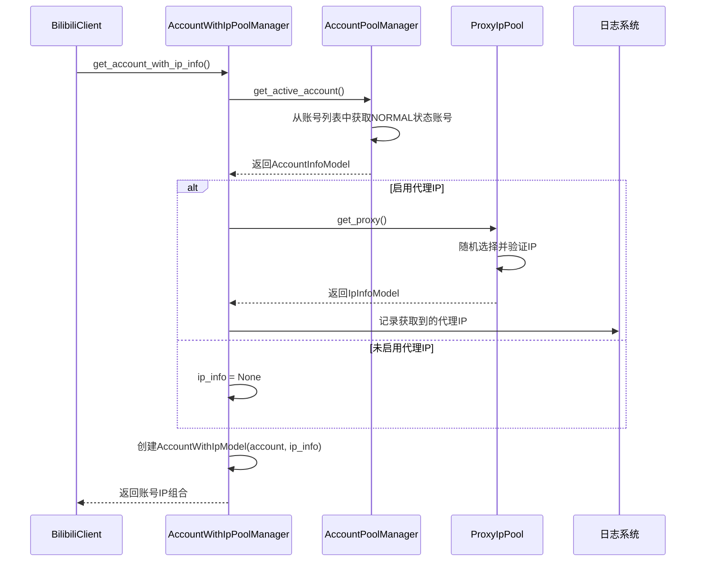
```mermaid
sequenceDiagram
    participant Client as BilibiliClient
    participant Manager as AccountWithIpPoolManager
    participant AccountPool as AccountPoolManager
    participant ProxyPool as ProxyIpPool
    participant Logger as 日志系统
    
    Client->>Manager: get_account_with_ip_info()
    
    Manager->>AccountPool: get_active_account()
    AccountPool->>AccountPool: 从账号列表中获取NORMAL状态账号
    AccountPool-->>Manager: 返回AccountInfoModel
    
    alt 启用代理IP
        Manager->>ProxyPool: get_proxy()
        ProxyPool->>ProxyPool: 随机选择并验证IP
        ProxyPool-->>Manager: 返回IpInfoModel
        Manager->>Logger: 记录获取到的代理IP
    else 未启用代理IP
        Manager->>Manager: ip_info = None
    end
    
    Manager->>Manager: 创建AccountWithIpModel(account, ip_info)
    Manager-->>Client: 返回账号IP组合
```

### 4.3 失效处理机制

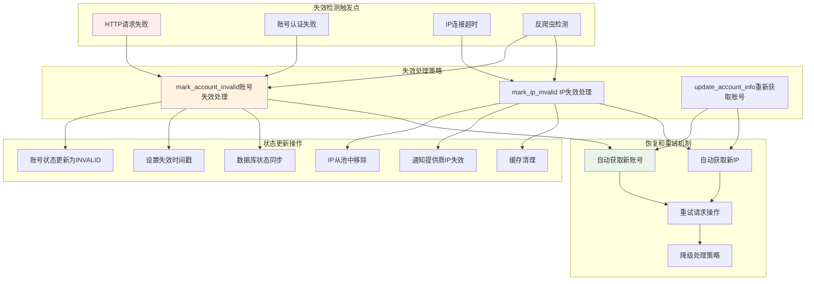
```mermaid
graph TB
    subgraph "失效检测触发点"
        A[HTTP请求失败]
        B[账号认证失败]
        C[IP连接超时]
        D[反爬虫检测]
    end
    
    subgraph "失效处理策略"
        E[mark_account_invalid账号失效处理]
        F[mark_ip_invalid IP失效处理]
        G[update_account_info重新获取账号]
    end
    
    subgraph "状态更新操作"
        H[账号状态更新为INVALID]
        I[设置失效时间戳]
        J[数据库状态同步]
        K[IP从池中移除]
        L[通知提供商IP失效]
        M[缓存清理]
    end
    
    subgraph "恢复和重试机制"
        N[自动获取新账号]
        O[自动获取新IP]
        P[重试请求操作]
        Q[降级处理策略]
    end
    
    A --> E
    B --> E
    C --> F
    D --> E
    D --> F
    
    E --> H
    E --> I
    E --> J
    F --> K
    F --> L
    F --> M
    
    E --> N
    F --> O
    G --> N
    G --> O
    
    N --> P
    O --> P
    P --> Q
    
    style A fill:#ffebee
    style E fill:#fff3e0
    style N fill:#e8f5e8
```

## 5. Bilibili爬虫中的账号IP集成

### 5.1 BilibiliCrawler初始化流程

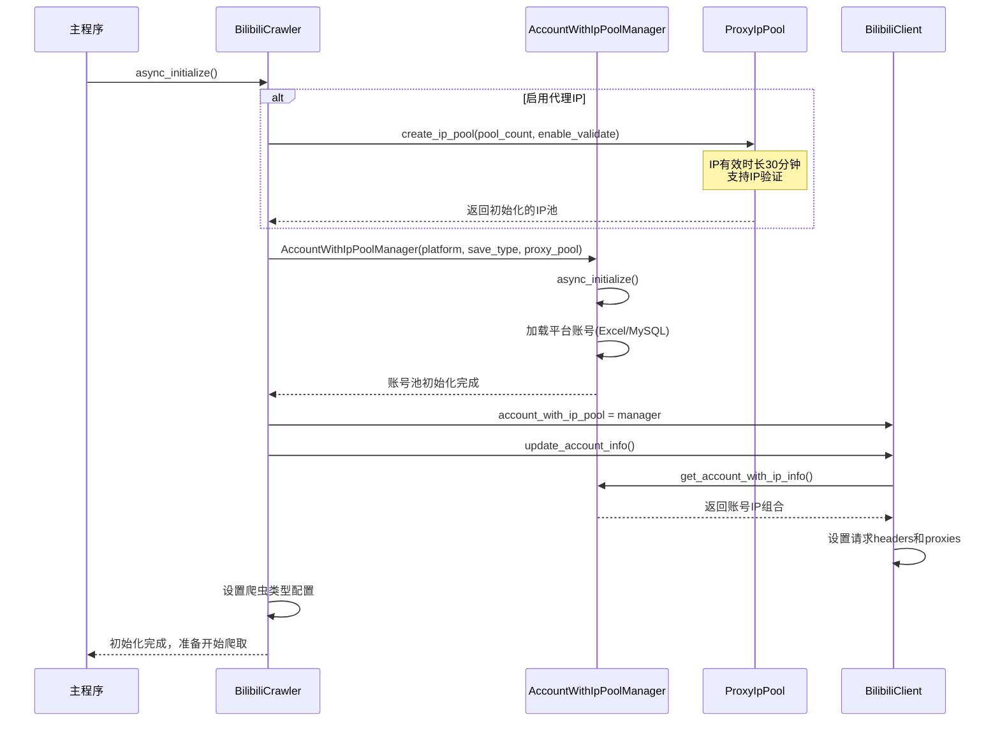
```mermaid
sequenceDiagram
    participant Main as 主程序
    participant Crawler as BilibiliCrawler
    participant Manager as AccountWithIpPoolManager
    participant ProxyPool as ProxyIpPool
    participant Client as BilibiliClient
    
    Main->>Crawler: async_initialize()
    
    alt 启用代理IP
        Crawler->>ProxyPool: create_ip_pool(pool_count, enable_validate)
        Note over ProxyPool: IP有效时长30分钟<br/>支持IP验证
        ProxyPool-->>Crawler: 返回初始化的IP池
    end
    
    Crawler->>Manager: AccountWithIpPoolManager(platform, save_type, proxy_pool)
    Manager->>Manager: async_initialize()
    Manager->>Manager: 加载平台账号(Excel/MySQL)
    Manager-->>Crawler: 账号池初始化完成
    
    Crawler->>Client: account_with_ip_pool = manager
    Crawler->>Client: update_account_info()
    Client->>Manager: get_account_with_ip_info()
    Manager-->>Client: 返回账号IP组合
    Client->>Client: 设置请求headers和proxies
    
    Crawler->>Crawler: 设置爬虫类型配置
    Crawler-->>Main: 初始化完成，准备开始爬取
```

### 5.2 BilibiliClient请求处理

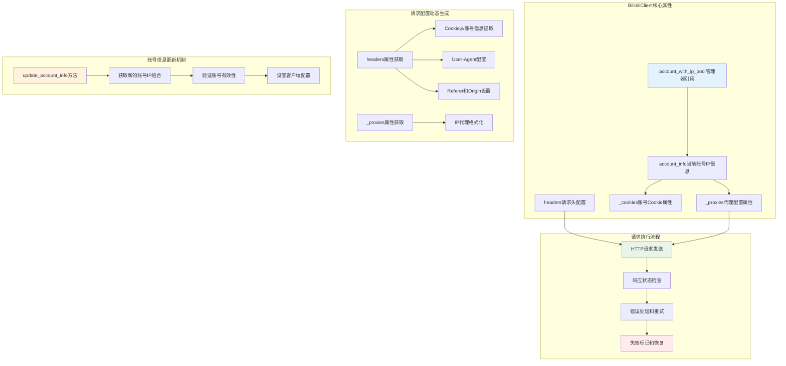
```mermaid
graph TB
    subgraph "BilibiliClient核心属性"
        A[account_with_ip_pool管理器引用]
        B[account_info当前账号IP信息]
        C[_proxies代理配置属性]
        D[_cookies账号Cookie属性]
        E[headers请求头配置]
    end
    
    subgraph "请求配置动态生成"
        F[headers属性获取]
        G[Cookie从账号信息提取]
        H[User-Agent配置]
        I[Referer和Origin设置]
        J[_proxies属性获取]
        K[IP代理格式化]
    end
    
    subgraph "账号信息更新机制"
        L[update_account_info方法]
        M[获取新的账号IP组合]
        N[验证账号有效性]
        O[设置客户端配置]
    end
    
    subgraph "请求执行流程"
        P[HTTP请求发送]
        Q[响应状态检查]
        R[错误处理和重试]
        S[失效标记和恢复]
    end
    
    A --> B
    B --> C
    B --> D
    
    F --> G
    F --> H
    F --> I
    J --> K
    
    L --> M
    M --> N
    N --> O
    
    E --> P
    C --> P
    P --> Q
    Q --> R
    R --> S
    
    style A fill:#e3f2fd
    style L fill:#fff3e0
    style P fill:#e8f5e8
    style S fill:#ffebee
```

### 5.3 请求失败恢复机制

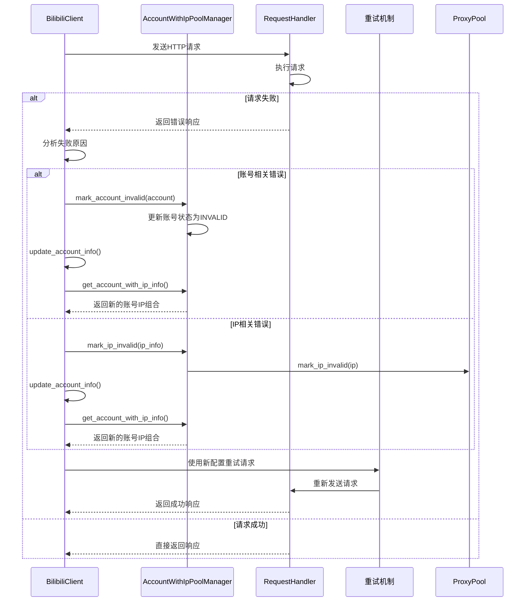
```mermaid
sequenceDiagram
    participant Client as BilibiliClient
    participant Manager as AccountWithIpPoolManager
    participant Handler as RequestHandler
    participant Retry as 重试机制
    
    Client->>Handler: 发送HTTP请求
    Handler->>Handler: 执行请求
    
    alt 请求失败
        Handler-->>Client: 返回错误响应
        Client->>Client: 分析失败原因
        
        alt 账号相关错误
            Client->>Manager: mark_account_invalid(account)
            Manager->>Manager: 更新账号状态为INVALID
            Client->>Client: update_account_info()
            Client->>Manager: get_account_with_ip_info()
            Manager-->>Client: 返回新的账号IP组合
        else IP相关错误
            Client->>Manager: mark_ip_invalid(ip_info)
            Manager->>ProxyPool: mark_ip_invalid(ip)
            Client->>Client: update_account_info()
            Client->>Manager: get_account_with_ip_info()
            Manager-->>Client: 返回新的账号IP组合
        end
        
        Client->>Retry: 使用新配置重试请求
        Retry->>Handler: 重新发送请求
        Handler-->>Client: 返回成功响应
    else 请求成功
        Handler-->>Client: 直接返回响应
    end
```

## 6. 配置和扩展性设计

### 6.1 配置驱动的灵活性

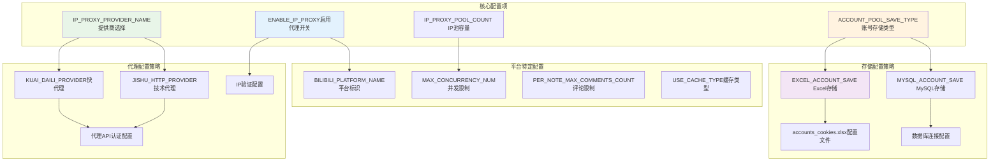
```mermaid
graph TB
    subgraph "核心配置项"
        A[ENABLE_IP_PROXY启用代理开关]
        B[IP_PROXY_POOL_COUNT IP池容量]
        C[IP_PROXY_PROVIDER_NAME提供商选择]
        D[ACCOUNT_POOL_SAVE_TYPE账号存储类型]
    end
    
    subgraph "平台特定配置"
        E[BILIBILI_PLATFORM_NAME平台标识]
        F[MAX_CONCURRENCY_NUM并发限制]
        G[PER_NOTE_MAX_COMMENTS_COUNT评论限制]
        H[USE_CACHE_TYPE缓存类型]
    end
    
    subgraph "存储配置策略"
        I[EXCEL_ACCOUNT_SAVE Excel存储]
        J[MYSQL_ACCOUNT_SAVE MySQL存储]
        K[accounts_cookies.xlsx配置文件]
        L[数据库连接配置]
    end
    
    subgraph "代理配置策略"
        M[KUAI_DAILI_PROVIDER快代理]
        N[JISHU_HTTP_PROVIDER技术代理]
        O[代理API认证配置]
        P[IP验证配置]
    end
    
    A --> E
    B --> F
    C --> M
    C --> N
    D --> I
    D --> J
    
    I --> K
    J --> L
    
    M --> O
    N --> O
    A --> P
    
    style A fill:#e3f2fd
    style D fill:#fff3e0
    style C fill:#e8f5e8
    style I fill:#f3e5f5
```

### 6.2 新平台和提供商扩展

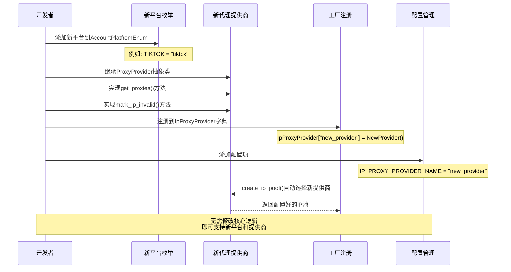
```mermaid
sequenceDiagram
    participant Dev as 开发者
    participant Platform as 新平台枚举
    participant Provider as 新代理提供商
    participant Factory as 工厂注册
    participant Config as 配置管理
    
    Dev->>Platform: 添加新平台到AccountPlatfromEnum
    Note over Platform: 例如: TIKTOK = "tiktok"
    
    Dev->>Provider: 继承ProxyProvider抽象类
    Dev->>Provider: 实现get_proxies()方法
    Dev->>Provider: 实现mark_ip_invalid()方法
    
    Dev->>Factory: 注册到IpProxyProvider字典
    Note over Factory: IpProxyProvider["new_provider"] = NewProvider()
    
    Dev->>Config: 添加配置项
    Note over Config: IP_PROXY_PROVIDER_NAME = "new_provider"
    
    Factory->>Provider: create_ip_pool()自动选择新提供商
    Provider-->>Factory: 返回配置好的IP池
    
    Note over Dev,Config: 无需修改核心逻辑<br/>即可支持新平台和提供商
```

### 6.3 系统监控和日志

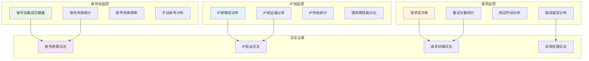
```mermaid
graph TB
    subgraph "账号池监控"
        A[账号加载成功数量]
        B[账号失效统计]
        C[账号轮换频率]
        D[平台账号分布]
    end
    
    subgraph "IP池监控"
        E[IP获取成功率]
        F[IP验证通过率]
        G[IP失效统计]
        H[提供商性能对比]
    end
    
    subgraph "请求监控"
        I[请求成功率]
        J[重试次数统计]
        K[响应时间分析]
        L[错误类型分布]
    end
    
    subgraph "日志记录"
        M[账号获取日志]
        N[IP验证日志]
        O[请求详细日志]
        P[异常处理日志]
    end
    
    A --> M
    B --> M
    E --> N
    F --> N
    I --> O
    J --> O
    L --> P
    
    style A fill:#e8f5e8
    style E fill:#e3f2fd
    style I fill:#fff3e0
    style M fill:#f3e5f5
```

## 7. 最佳实践与优化建议

### 7.1 账号池管理最佳实践

1. **账号质量管理**
   - 定期检查账号有效性
   - 合理配置账号轮换策略
   - 账号失效后及时更新状态

2. **存储策略选择**
   - 开发测试阶段推荐使用Excel存储
   - 生产环境推荐使用MySQL存储
   - 支持实时状态更新和统计分析

3. **平台适配优化**
   - 不同平台配置独立的账号池
   - 根据平台特性调整请求频率
   - 实现平台特定的失效检测逻辑

### 7.2 IP代理管理最佳实践

1. **提供商选择策略**
   - 根据目标平台选择合适的代理提供商
   - B站推荐使用长时效IP（30分钟）
   - 启用IP验证提高成功率

2. **IP池配置优化**
   - 合理设置IP池容量（推荐10-50个）
   - 开启IP有效性验证
   - 实现IP轮换和失效处理

3. **缓存和性能优化**
   - 使用Redis缓存IP状态
   - 实现IP预加载机制
   - 监控IP使用效率

### 7.3 系统性能优化

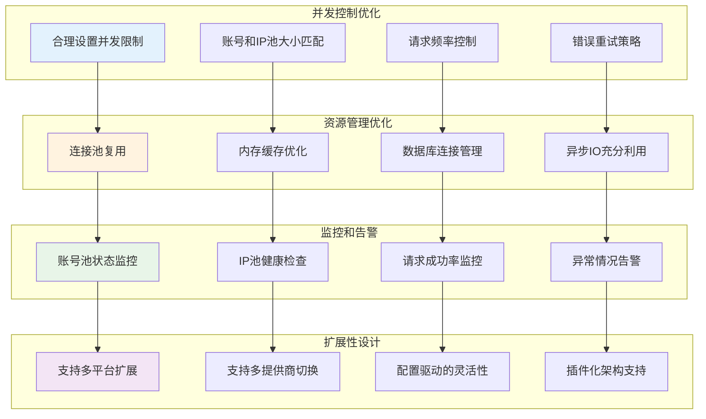
```mermaid
graph TB
    subgraph "并发控制优化"
        A[合理设置并发限制]
        B[账号和IP池大小匹配]
        C[请求频率控制]
        D[错误重试策略]
    end
    
    subgraph "资源管理优化"
        E[连接池复用]
        F[内存缓存优化]
        G[数据库连接管理]
        H[异步IO充分利用]
    end
    
    subgraph "监控和告警"
        I[账号池状态监控]
        J[IP池健康检查]
        K[请求成功率监控]
        L[异常情况告警]
    end
    
    subgraph "扩展性设计"
        M[支持多平台扩展]
        N[支持多提供商切换]
        O[配置驱动的灵活性]
        P[插件化架构支持]
    end
    
    A --> E
    B --> F
    C --> G
    D --> H
    
    E --> I
    F --> J
    G --> K
    H --> L
    
    I --> M
    J --> N
    K --> O
    L --> P
    
    style A fill:#e3f2fd
    style E fill:#fff3e0
    style I fill:#e8f5e8
    style M fill:#f3e5f5
```

## 8. 总结

MediaCrawlerPro的多账号和IP系统体现了以下优秀的设计理念：

1. **模块化设计**: 账号池、IP池、组合管理器职责清晰分离
2. **抽象化接口**: 通过抽象基类支持多种存储和提供商策略
3. **组合模式**: AccountWithIpModel优雅地组合账号和IP信息
4. **工厂模式**: 配置驱动的对象创建，支持灵活扩展
5. **失效恢复**: 完善的错误处理和自动恢复机制
6. **异步优化**: 全异步IO操作，提升系统性能

通过深入学习这套多账号和IP管理系统，可以掌握现代爬虫系统的核心设计模式和最佳实践，为构建稳定、高效的数据采集系统提供重要参考。

---

**再次提醒：本项目仅供学习和研究目的使用，请严格遵守相关法律法规和平台使用条款，不得用于任何商业用途或违法行为。**